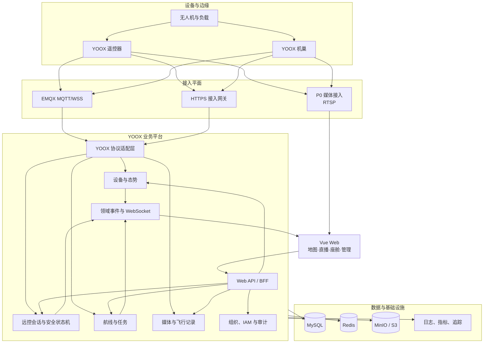
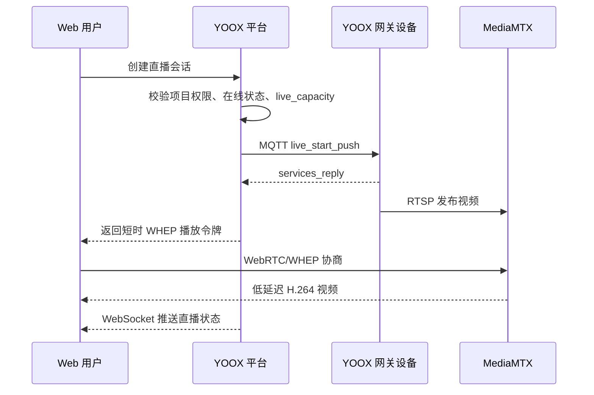
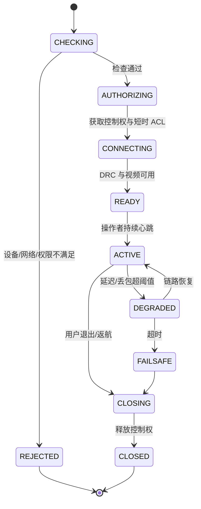

# YOOX Cloud GCS 项目总体方案

> 文档版本：1.2  
> 编制日期：2026-07-29  
> 基础工程：YOOX 上云 API Demo  
> 目标工程：YOOX Cloud GCS

## 1. 方案摘要

YOOX Cloud GCS 定位为面向 YOOX 行业无人机生态的多租户、Web 化云端地面站。平台将现有
YOOX Cloud API Demo 从“协议示例服务”升级为具备生产可用性、飞行安全控制、完整产品界面和
公私有云交付能力的业务平台。

建议采用“**设备协议适配层 + 模块化业务平台 + 独立媒体平面**”的架构：

- 设备侧继续遵循 YOOX MQTT 物模型、HTTPS 和 WebSocket/WSS，不改变端侧协议。
- 业务侧以组织、项目和设备为资源边界，补齐 RBAC、审计、告警、任务编排和数据归档。
- 上云 API 的协议能力包含 RTMP、RTSP、GB28181，但 P0 平台只启用 RTSP 设备推流；浏览器统一
  通过 WebRTC/WHEP 播放。
- 虚拟座舱采用短时凭证、精确 Topic ACL、控制权租约和安全状态机。
- 第一阶段使用模块化单体降低协议适配风险，容量增长后按媒体、遥测、任务领域拆分。
- 开发、测试、公有云和私有化均使用 Docker + Docker Compose，同一套镜像和 Compose 模板通过
  环境配置完成差异化部署。
- 后期建设 YOOX 可视化运维平台，统一查看和管理各节点容器、服务健康度、日志、指标和告警。

首期建议以 18 周、100 台在线设备、20 路并发直播、5 路并发远控作为验收基线。具体规模须在
立项时用真实设备、真实网络重新校准。

## 2. 参考边界与设计依据

### 2.1 YOOX Cloud API

YOOX 官方说明，上云 API 是基于 MSDK 的上层抽象，网关设备与第三方平台采用
MQTT、HTTPS、WebSocket，并允许第三方平台部署在可被设备访问的公有云或私有环境中。平台必须
以 YOOX 设备实际上报的物模型和能力集为准，而不是以页面固定选项为准。

本方案采用的关键官方约束：

- 遥测分为定频 `osd` 和事件性 `state` Topic。
- 直播能力由 `live_capacity` 动态上报；不同设备、相机和固件可用码流不同。
- 直播控制包括开始、停止、清晰度设置和镜头切换；上云 API 能力包含 RTMP、RTSP、GB28181。
- P0 实现和部署只启用 RTSP；RTMP、GB28181 仅作为后期协议能力写入 API 指南，不进入首期代码、
  端口开放、部署和验收范围。
- 航线文件遵循 KMZ/WPML；任务包含立即和定时执行、取消及进度上报。
- 设备媒体上传应先获取 STS 临时凭证，再直传对象存储。

### 2.2 大疆司空 2

司空 2 仅作为产品能力和交互体验参考，参考内容包括：

- 项目地图、设备小窗、实时直播和设备态势。
- 虚拟座舱中的一键起飞、WASD 控制、轨迹、返航、云台与相机操作。
- 航线创建、航线编辑和地图点线面标注。
- 公有云与私有化两种产品形态。

YOOX Cloud GCS 不复用 DJI 设备协议、代码或专有组件，也不承诺 YOOX 设备具备 DJI 同等功能。
所有功能必须经过“机型 + 负载 + 固件 + 网络”四维能力验证后开放。

### 2.3 参考资料

- YOOX 上云 API：产品架构、Topic 定义、设备属性、直播、航线、媒体和指令飞行资料。
- YOOX 上云 API Demo：设备接入、物模型 DTO、控制、直播、航线、媒体和部署实现。
- [大疆司空 2 前端组件概述](https://fh.dji.com/user-manual/cn/custom-development/frontend-components/component-introduction.html)
- [大疆司空 2 远程控制](https://fh.dji.com/user-manual/cn/real-time-project-information/device-status-window.html)
- [DJI FlightHub 2 FAQ](https://enterprise.dji.com/flighthub-2/faq)

## 3. 建设目标

### 3.1 业务目标

- 一个网页完成设备接入、态势监控、直播、远控、航线任务和运维管理。
- 支持多组织、多项目、多设备协作，确保跨租户资源严格隔离。
- 提供一致的公有云和私有化体验，私有化环境可以离线运行。
- 形成设备、任务、视频、媒体、告警和审计的完整业务闭环。
- 将硬件差异封装在 YOOX 适配层，业务模块不直接依赖具体机型枚举。

### 3.2 首期非目标

- 不自研飞控算法，不绕过 YOOX 原生安全策略。
- 不保证所有 YOOX 机型、负载、固件都支持同一控制能力。
- 不在首期实现云端三维重建、AI 识别、蜂群调度和跨厂家统一控制。
- 不把示例 Demo 的账号体系、硬编码密钥、单工作空间模型直接用于生产。
- 不以公网远程飞行为默认开启项；远控必须经过组织授权和现场安全评审。

## 4. 用户、角色和核心场景

| 角色 | 主要职责 | 关键权限 |
| --- | --- | --- |
| 平台管理员 | 租户、部署、资源配额和全局运维 | 平台配置、租户管理、审计只读 |
| 组织管理员 | 组织成员、项目、设备归属 | 成员、角色、设备绑定、策略 |
| 项目管理员 | 项目资源和作业配置 | 航线、任务、围栏、媒体、告警 |
| 调度员 | 监看设备并创建/中止任务 | 直播、任务下发、返航 |
| 飞手 | 获得控制权并执行远控 | 虚拟座舱、云台、相机 |
| 设备维护员 | 设备、机巢、固件、日志和告警 | 运维操作，无飞行控制权 |
| 观察员/审计员 | 只读监控或审计 | 只读直播、记录、审计 |

典型闭环：

1. 管理员创建组织和项目，生成绑定码或设备凭证。
2. 遥控器/机巢配置 MQTT、HTTPS、组织绑定信息并上线。
3. 平台接收拓扑与 OSD，在地图和设备小窗实时展示。
4. 调度员按设备能力开启直播，浏览器建立 WHEP 会话。
5. 飞手完成二次确认和检查单，获取排他控制权后进入虚拟座舱。
6. 项目管理员创建或导入 WPML 航线，验证后下发立即/定时任务。
7. 平台关联任务进度、飞行轨迹、媒体、告警和操作审计。

## 5. 功能范围和版本分层

### 5.1 P0：首期生产 MVP

| 领域 | P0 功能 |
| --- | --- |
| 组织与权限 | 组织、项目、用户、角色、资源级权限、登录、OIDC 预留、审计 |
| 态势地图 | 设备位置、航向、轨迹、在线状态、电量、信号、HMS 告警 |
| 设备管理 | 网关/无人机/负载拓扑、绑定、重命名、详情、属性、日志、基础固件信息 |
| 实时直播 | P0 RTSP、能力发现、开始/停止、镜头/清晰度、单路/四分屏、弱网重连、会话超时 |
| 虚拟座舱 | 控制权、WASD/虚拟摇杆、起飞到点、指点飞行、返航、云台、拍照/录像 |
| 航线管理 | KMZ/WPML 导入、版本、预览、校验、立即/定时任务、暂停/继续/取消、进度 |
| 媒体与记录 | STS 上传、媒体列表、任务关联、飞行轨迹、操作记录 |
| 部署运维 | Docker Compose 全服务部署、监控告警、备份恢复、离线安装与升级说明 |

### 5.2 P1：增强版本

- 可视化航点和面状航线编辑、模板库、航线版本对比。
- 多路直播大屏、直播录制和分享链接。
- 按业务需求逐步启用 RTMP 接入和 GB28181 接入/转发。
- 自定义作业区/禁飞区、设备侧围栏同步和审批流。
- 远程机巢调试、OTA 编排、维护工单和告警闭环。
- 飞行记录回放、视频与轨迹时间轴同步。
- 企业 SSO、LDAP/OIDC、配额、计费统计和 OpenAPI。

### 5.3 P2：规模化与智能化

- AI 目标识别、告警联动、自动派遣。
- 二/三维模型重建和测量分析。
- 跨区域媒体边缘节点、海量遥测分析和数据湖。
- 多机任务编排、跨项目资源同步和第三方业务工作流。
- YOOX Ops Console：多节点容器、健康度、日志、指标、告警、升级和审计的可视化运维。

### 5.4 Web 信息架构

参考司空 2 的“项目地图 + 设备小窗 + 驾驶舱”使用方式，YOOX Web 建议采用两级导航：

| 层级 | 页面 | 核心内容 |
| --- | --- | --- |
| 平台/组织 | 总览 | 组织资源、在线设备、活跃任务、告警、存储和直播用量 |
| 平台/组织 | 设备池 | 待绑定/已绑定设备、固件、维护、组织间调拨 |
| 平台/组织 | 成员与角色 | 用户、角色、项目授权、飞手资质 |
| 平台/组织 | 系统设置 | 地图、媒体节点、通知、SSO、配额、审计 |
| 项目 | 实时地图 | 设备、轨迹、标注、围栏、任务和设备小窗 |
| 项目 | 虚拟座舱 | 单机视频、飞行仪表、地图、云台相机和控制台 |
| 项目 | 多路直播 | 1/4/9/16 宫格、轮巡、全屏和会话状态 |
| 项目 | 航线库 | 航线文件、版本、编辑、校验和兼容设备 |
| 项目 | 任务中心 | 计划、执行进度、失败原因、暂停/恢复/取消 |
| 项目 | 媒体与飞行记录 | 任务媒体、轨迹回放、告警时间轴和导出 |
| 项目 | 设备 | 项目设备、拓扑、状态、HMS、日志和远程维护 |
| 项目 | 告警 | 实时告警、确认、指派、处理和关闭 |

虚拟座舱采用“左侧视频、中央/右侧地图、底部仪表和控制条”的可调整布局。危险按钮在视觉和交互上
与普通相机操作分区；禁用状态必须显示不可操作原因。页面在进入全屏、失焦、刷新和关闭时都要执行
明确的控制会话生命周期处理。

## 6. 总体架构



### 6.1 架构原则

1. **协议与业务隔离**：YOOX Topic、物模型 DTO 和固件差异只存在于适配层。
2. **能力驱动 UI**：页面按钮由服务端返回的设备能力和当前状态决定。
3. **控制平面与媒体平面分离**：直播故障不能拖垮设备管理和飞行指令。
4. **先模块化单体、后按压力拆分**：首期避免分布式事务和协议调试复杂度。
5. **所有危险操作可追责**：控制权、指令、任务和属性变更必须记录操作者与结果。
6. **同制品多形态交付**：差异只放在配置、基础设施适配器和部署清单中。

## 7. 领域模块设计

### 7.1 组织、项目与权限

- 租户层级：`platform -> organization -> project/workspace -> resource`。
- 资源权限采用 RBAC + 条件约束，例如飞手只能在指定项目、时间窗和设备范围内远控。
- 高风险动作支持二次确认、MFA/Step-up 和双人审批开关。
- 访问令牌短期有效，Refresh Token 可撤销；密码采用 Argon2id 或 bcrypt。
- 所有数据库查询强制携带 `tenant_id` 和 `project_id`，并用集成测试验证租户隔离。

### 7.2 设备与实时态势

- 统一表示网关、遥控器、机巢、无人机、负载和电池的拓扑关系。
- `state` 写入设备状态与事件；`osd` 更新 Redis 最新态并异步归档飞行轨迹。
- 设备在线状态采用 MQTT 上下线事件、心跳和最后 OSD 时间综合判断。
- 建立能力快照：机型、固件、负载、支持协议、镜头、控制、航线和属性。
- 地图坐标层统一存 WGS84；展示层通过适配器转换 GCJ-02 等坐标系。
- 地图引擎与底图解耦，私有化支持离线矢量/影像瓦片。

### 7.3 直播与多路监控

设备发布和浏览器播放链路：



设计要求：

- 设备发布地址与浏览器播放地址分离；播放地址不得暴露设备永久凭证。
- 流路径使用不可预测会话 ID，MediaMTX 前置鉴权或回调鉴权。
- 配置 coturn 处理复杂 NAT；公网 ICE 地址不写死在镜像中。
- 设备返回业务成功后，继续检查媒体路径是否真正出现视频帧。
- 退出页面、无观看者或超过策略时长后自动停流，防止无效资源占用。
- 首期固定浏览器接收 H.264 视频；H.265、音频和转码按设备矩阵单独验证。
- 多实例部署时，直播会话目录记录 `media_node_id`，控制面按会话路由。

### 7.4 虚拟座舱与远程控制

远控不是普通 REST 操作，必须以排他会话管理：



控制安全要求：

- Redis 原子租约保证同一设备只有一个有效飞手，租约需心跳续期。
- Web 端只获取限定设备、限定方向、限定有效期的 MQTT over WSS 凭证。
- 输入控制使用 dead-man switch；浏览器失焦、网络中断或心跳过期立即停止连续量输入。
- 进入座舱前检查电量、定位、图传、风速、设备状态、围栏、任务冲突和控制权限。
- 弱网状态禁止起飞、指点飞行等新增动作，仅保留安全收敛动作。
- 关键动作二次确认：起飞、指点飞行、降落、返航、抢夺控制权。
- 服务端记录会话、控制权变化、高级指令及应答；高频摇杆只保留摘要和异常片段。
- 前端显示端到端延迟、上/下行质量、控制权持有人和失效倒计时。

### 7.5 航线与任务

- 航线文件采用不可变版本；修改生成新版本，已执行任务仍引用旧版本。
- 导入时完成 ZIP/KMZ 安全检查、WPML 结构校验、坐标范围、机型/负载匹配和动作白名单。
- 任务下发前校验设备在线、空闲、电量、固件、航线范围、围栏和时间同步。
- YOOX 立即任务存在时间误差约束，平台必须启用 NTP 并在下发前检查时钟偏差。
- 任务状态统一为 `DRAFT/SCHEDULED/PREPARING/RUNNING/PAUSED/SUCCEEDED/CANCELED/FAILED`。
- MQTT `tid/bid`、业务 `request_id` 和数据库唯一键共同保证幂等。
- 进度事件、媒体和轨迹以 `mission_run_id` 关联，支持完整复盘。

### 7.6 媒体、飞行记录与告警

- 设备仅获取限定目录、限定时长的 STS 临时凭证并直传对象存储。
- 元数据先落库，文件异步校验 MD5、MIME、大小和恶意内容。
- 媒体按组织/项目/任务/设备分区，并支持生命周期和保留策略。
- HMS、设备离线、低电、弱信号、任务失败统一转为告警事件。
- 告警包含确认、指派、关闭和评论状态；通知渠道作为可插拔模块。

## 8. API 与事件契约

Web API 统一前缀建议为 `/api/v1`：

| API 域 | 示例 |
| --- | --- |
| 身份 | `/auth/login`、`/auth/refresh`、`/me` |
| 组织/项目 | `/organizations`、`/projects/{projectId}` |
| 设备 | `/projects/{projectId}/devices`、`/devices/{sn}/capabilities` |
| 直播 | `/livestream-sessions`、`/livestream-sessions/{id}:stop` |
| 座舱 | `/cockpit-sessions`、`/{id}:enter`、`/{id}:heartbeat`、`/{id}:exit` |
| 航线 | `/waylines`、`/wayline-versions`、`/mission-runs` |
| 媒体/告警 | `/media-assets`、`/alerts` |
| 审计 | `/audit-logs` |

危险写操作必须携带 `Idempotency-Key`，并返回业务请求 ID。WebSocket 事件统一封装：

```json
{
  "event_id": "01J...",
  "event_type": "device.osd.updated.v1",
  "occurred_at": "2026-07-29T16:00:00.123+08:00",
  "organization_id": "org_...",
  "project_id": "prj_...",
  "resource": {"type": "device", "id": "SN..."},
  "sequence": 10241,
  "trace_id": "trace_...",
  "data": {}
}
```

YOOX 原始 Topic 和 DTO 不直接暴露给 Web；适配层负责转换为稳定的领域模型。原始消息可按采样策略
写入对象存储，用于协议追溯。

## 9. 数据模型

建议首期核心表：

- 租户权限：`organization`、`project`、`user`、`role`、`role_binding`。
- 设备：`device`、`device_relation`、`payload`、`device_capability_snapshot`、`device_event`。
- 直播/控制：`livestream_session`、`control_session`、`control_command_audit`。
- 航线：`wayline`、`wayline_version`、`mission_plan`、`mission_run`、`mission_event`。
- 媒体：`media_asset`、`media_upload`、`flight_record`、`flight_track_segment`。
- 运维：`alert`、`audit_log`、`outbox_event`、`idempotency_record`。

存储分工：

- MySQL：业务主数据、权限、任务、会话、审计和元数据。
- Redis：在线状态、最新 OSD、控制租约、短时 ACL、幂等缓存和 WebSocket 会话。
- MinIO/S3：KMZ、媒体、日志、固件、导出和原始事件归档。
- ClickHouse（规模化配置）：长周期 OSD、轨迹和运营分析；P0 可先按飞行分段压缩存入 MySQL/对象存储。

## 10. 技术选型

| 层 | 推荐 | 说明 |
| --- | --- | --- |
| Web | Vue 3 + TypeScript + Vite + Pinia | 组件化、类型安全、适合管理台与座舱 |
| 地图 | CesiumJS + 地图 Provider 适配层 | 2D/3D 航线、轨迹、围栏；兼容离线瓦片 |
| 后端 | Java 21 + 受支持的 Spring Boot 3.x | 迁移 Demo 的 Java 17/Spring Boot 2.7 基线 |
| 数据访问 | MyBatis-Plus + Flyway | 复用现有 Mapper，并建立可版本化迁移 |
| MQTT | EMQX | BASIC 与 DRC/WSS，生产启用 TLS、ACL、集群 |
| 实时推送 | Spring WebSocket | 对 Web 输出稳定的领域事件 |
| 媒体 | MediaMTX + coturn | 设备多协议接入，浏览器统一 WHEP |
| 对象存储 | MinIO / S3 接口 | 公私有统一 |
| 可观测性 | OpenTelemetry + Prometheus + Grafana + Loki | 指标、日志、追踪和告警 |
| 交付 | Docker Engine + Docker Compose | 开发、测试、公有云、私有化统一容器编排 |
| 运维 | Prometheus + Grafana + Loki + Alertmanager + cAdvisor | 容器、主机、应用和基础服务监控 |

不建议在首期直接采用微服务。设备协议、事务和状态机尚需真实硬件验证时，模块化单体更容易调试，
也更适合 Docker Compose 部署。媒体服务、MQTT 和可观测性组件保持独立容器，未来需要拆分遥测、
任务和媒体控制服务时，仍通过 Compose 服务扩展完成部署。

## 11. 安全与飞行安全

### 11.1 网络和应用安全

- 所有 HTTP、WebSocket、MQTT 和媒体信令使用 TLS；设备侧能力允许时使用 mTLS。
- 密钥通过 Docker Secret、受控 `.env`、Vault/KMS 或离线密钥库注入，不进入代码和镜像。
- MQTT ACL 精确到客户端和 Topic；禁止 Demo 中的全 Topic 权限。
- 播放和上传凭证短时有效、单资源绑定、可撤销。
- API 使用速率限制、重放防护、CSRF/CORS 策略和参数白名单。
- 达到 OWASP ASVS L2，发布前执行 SAST、DAST、依赖和镜像漏洞扫描。
- 审计日志采用追加写入，定期封存到对象存储并做哈希校验。

### 11.2 远程飞行安全

- 远控功能默认关闭，由组织级策略和设备白名单共同启用。
- 建立飞手资质、审批、时间窗、作业区域和现场安全员信息。
- 控制前检查、弱网降级、失联动作、返航高度和禁飞区必须可配置并被审计。
- 在封闭测试场完成逐级放量：桨叶卸载仿真 -> 系留/室内 -> 视距内 -> 受控生产。
- 法规、空域和保险要求由项目所在地责任主体确认；平台不替代飞手判断和设备原生安全系统。

## 12. 公有云与私有化策略

| 维度 | 公有云 | 私有化 |
| --- | --- | --- |
| 计算 | 多台云主机分别运行 Docker Compose 项目 | 单机或多节点 Docker Compose |
| 数据库 | Compose 管理的 MySQL 主从/InnoDB Cluster | Compose 管理的 MySQL 主从/InnoDB Cluster |
| Redis | Compose 管理的 Sentinel/Cluster | Compose 管理的 Sentinel/Cluster |
| 对象存储 | Compose 管理的分布式 MinIO | Compose 管理的分布式 MinIO |
| MQTT | Compose 管理的 EMQX 集群 | Compose 管理的 EMQX 集群 |
| 媒体 | Compose 管理的区域 MediaMTX + coturn | 本地 MediaMTX + coturn 容器 |
| 地图 | 在线地图服务 | 离线瓦片和本地地形 |
| 身份 | 平台账号/OIDC | 本地账号、LDAP/OIDC |
| 升级 | 按 Compose 节点分批升级 | 离线签名包、备份后升级 |
| 外部依赖 | 可使用云短信/邮件 | 默认无互联网依赖 |
| 运维 | YOOX Ops Console 统一管理云主机容器 | YOOX Ops Console 统一管理客户节点容器 |

具体拓扑、容量和端口见[部署与容量规划](04-部署与容量规划.md)。

## 13. 质量目标

以下是首期验收目标，不代表 YOOX 硬件在任意网络下的绝对保证：

| 指标 | 目标 |
| --- | --- |
| 核心 API 月可用性 | 公有云 99.9%，标准私有化集群 99.5% |
| 最新 OSD 展示数据年龄 | 合格网络下 P95 <= 3 秒 |
| 直播首帧 | 合格网络下 P95 <= 5 秒 |
| 视频端到端延迟 | 同城合格网络下 P95 <= 1.5 秒 |
| 控制指令交互延迟 | 同城合格网络下 P95 <= 300 毫秒，超阈值进入降级 |
| 控制权排他 | 任何并发条件下同设备最多一个有效控制租约 |
| 业务主数据 | 默认 RPO <= 15 分钟，RTO <= 2 小时 |
| 审计覆盖 | 危险操作 100% 记录操作者、资源、请求、结果、时间 |

“合格网络”的 RTT、丢包、抖动、上行带宽和 NAT 类型应在现场验收前写入测试协议。

## 14. 关键风险与对策

| 风险 | 影响 | 对策 |
| --- | --- | --- |
| 机型/固件能力不一致 | 页面可见但设备不执行 | 建立真机矩阵，能力驱动 UI，灰度白名单 |
| DRC 弱网与浏览器后台失活 | 失控或延迟动作 | 控制租约、dead-man、链路分级、自动安全收敛 |
| H.265/NAT/防火墙差异 | 浏览器无画面 | H.264 基线、WHEP、TURN、部署前网络探测 |
| Demo 为示例级安全 | 越权、泄密 | 重建 IAM、密码、密钥、ACL、审计和媒体鉴权 |
| Spring Boot 2.7 基线老旧 | 依赖漏洞和维护风险 | 协议回归测试保护下迁移至受支持版本 |
| WPML 兼容与时间误差 | 任务失败 | Schema/能力/时钟预检，任务幂等和错误映射 |
| 公私有形成代码分叉 | 维护成本翻倍 | 同镜像、配置适配、自动化离线包测试 |
| 示例源码授权不清晰 | 商用合规风险 | 正式向 YOOX 确认授权并固化第三方清单 |
| 地图坐标与合规 | 航线偏移或合规问题 | 内部 WGS84、Provider 适配、现场标定 |

## 15. 方案决策与待确认项

已建议的决策：

1. 以现有 Demo 为协议参考和适配层来源，不把其整体直接当作生产平台。
2. P0 使用模块化单体，媒体和 MQTT 独立部署。
3. P0 设备固定使用 RTSP 发布，浏览器统一通过 WebRTC/WHEP 播放。
4. Java 基线迁移至 Java 21 和受支持的 Spring Boot 3.x。
5. 首期先交付 YOOX 单厂商能力，预留 `DeviceVendorAdapter`，不提前建设跨厂商平台。
6. 所有服务统一使用 Docker + Docker Compose 部署，不引入其他容器编排体系。
7. 项目代码、Compose 配置、配置指南和 API 指南必须在同一版本同步生成和发布。
8. P0 设备推流固定使用 RTSP；RTMP、GB28181 只在 API 指南中作为后期可扩展协议说明。

立项前待确认：

- 真实硬件与固件矩阵，特别是机巢、遥控器上云和 DRC 支持范围。
- 首批客户部署网络、设备规模和并发直播/远控规模。
- 是否首期必须具备可视化航线编辑，还是先完成导入、管理和执行。
- 私有化是否要求完全离线、国密、等保、国产化数据库/中间件。
- 视频是否需要音频、录制、分享、国标级联和长周期存储。
- 地图来源、许可和离线数据交付方式。

## 16. 文档同步交付要求

后期生成项目时，代码不是唯一交付物。每个版本必须同步生成并校验：

- `docs/配置指南.md`：环境变量、Compose profiles、端口、域名、证书、数据库、MQTT、媒体、
  地图、存储、监控、公有云/私有化示例、升级和排障。
- `docs/API指南.md`：认证、REST API、WebSocket 事件、错误码、幂等、分页、调用示例和变更记录；
  同时列出 RTMP、RTSP、GB28181 三种上云协议能力，并清楚标识 `RTSP=P0 已启用`、
  `RTMP/GB28181=后期规划`。
- `openapi/openapi.json`：由后端注解或契约生成，可在 Swagger UI/ReDoc 中浏览。
- `asyncapi/asyncapi.yaml`：记录 WebSocket/MQTT 事件结构、Topic、方向、示例和版本。
- `.env.example` 与 Compose 配置项清单：必须与配置指南逐项对应，不允许只在代码中新增配置。

CI 必须检查 OpenAPI/AsyncAPI 是否可解析、示例请求是否通过契约测试、环境变量是否被配置指南覆盖。
任何接口或配置变更，必须在同一个提交/合并请求中更新对应指南，否则禁止发布。详细规范见
[配置指南与 API 指南同步交付规范](05-文档同步交付规范.md)。
