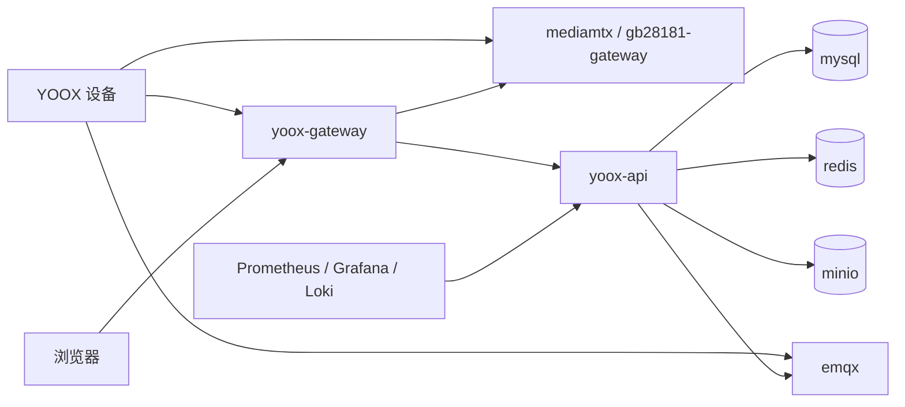
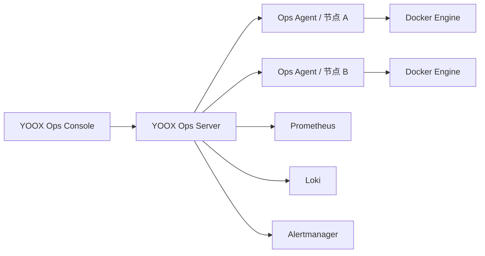

# YOOX Cloud GCS Docker Compose 部署与容量规划

## 1. 部署原则

- 开发、测试、公有云和私有化全部使用 Docker Engine + Docker Compose。
- Web、API、设备接入、异步任务、媒体控制和后期运维平台均以版本化容器运行。
- MySQL、Redis、MinIO、EMQX、媒体和可观测性服务也提供标准 Compose 定义。
- 同一 Git 版本生成同一组镜像、Compose 文件、数据库迁移、配置指南和 API 指南。
- 环境差异只能通过 `.env`、Compose override、profiles、挂载配置和 Secret 表达。
- 镜像使用固定版本或 digest，生成 SBOM 并签名，禁止生产使用 `latest`。
- Compose 本身只负责单主机编排；多节点通过多个 Compose 项目、节点内网、负载均衡和服务自身集群
  机制实现，不依赖其他容器编排体系。

## 2. 容器清单

### 2.1 YOOX 业务容器

| 容器 | 职责 | P0 形态 |
| --- | --- | --- |
| `yoox-web` | Vue 管理台、地图、直播和虚拟座舱静态资源 | Nginx 容器 |
| `yoox-gateway` | TLS、反向代理、API 限流、WHEP 代理 | Nginx/Traefik 容器 |
| `yoox-api` | IAM、设备、直播、座舱、航线、媒体、告警 API | 模块化业务服务容器 |
| `yoox-device-adapter` | MQTT 物模型、设备状态和指令适配 | 独立容器 |
| `yoox-worker` | 事件 Outbox、媒体处理、任务和通知异步作业 | 独立容器 |
| `yoox-migration` | Flyway 数据库迁移 | 一次性任务容器 |
| `yoox-docs` | Swagger UI/ReDoc、API 指南和配置指南 | 文档站容器 |

P0 可以将同步业务模块打包在 `yoox-api` 中，以减少协议联调复杂度；当容量或团队边界要求拆分时，
设备、座舱、航线、媒体等服务仍以独立容器加入 Compose，不改变部署体系。

### 2.2 基础服务容器

| 容器 | 职责 |
| --- | --- |
| `mysql` | 业务主数据、任务、会话和审计 |
| `redis` | 在线态、控制租约、幂等和短时凭证 |
| `minio` | 航线、媒体、日志、固件和归档 |
| `emqx` | 设备 MQTT、DRC MQTT over WSS |
| `mediamtx` | P0 RTSP 接入与 WebRTC/WHEP 播放；关闭 RTMP 监听 |
| `coturn` | WebRTC NAT 穿透 |
| `ntp` | 私有化环境统一时间基线，可接客户现有 NTP |

RTMP 和 GB28181 属于后期扩展能力，P0 不启动对应接入服务、不开放监听端口，也不在前端提供协议选择。
后期启用时再增加相应 Compose service/profile，不能以未使用的常驻容器预埋。

### 2.3 可观测性容器

| 容器 | 职责 |
| --- | --- |
| `prometheus` | 指标采集和规则计算 |
| `grafana` | 健康看板和容量趋势 |
| `loki` | 容器与应用日志检索 |
| `promtail` 或 `alloy` | 节点日志采集 |
| `alertmanager` | 告警路由、抑制和通知 |
| `cadvisor` | 容器资源指标 |
| `node-exporter` | 主机 CPU、内存、磁盘和网络 |
| `blackbox-exporter` | HTTP、TCP、TLS 和外部可达性探测 |

## 3. Compose 工程结构

```text
deploy/compose/
├── compose.yaml                    # 核心业务与数据服务
├── compose.media.yaml              # P0 RTSP/WHEP/TURN
├── compose.observability.yaml      # Prometheus/Grafana/Loki/Alertmanager
├── compose.ops.yaml                # 后期 YOOX Ops Console 与 Agent
├── env/
│   ├── dev.env.example
│   ├── test.env.example
│   ├── public.env.example
│   └── private.env.example
├── config/
│   ├── nginx/
│   ├── emqx/
│   ├── mediamtx/
│   ├── prometheus/
│   └── grafana/
├── secrets/                        # 仅保存模板与说明，不提交真实 Secret
├── scripts/
│   ├── preflight.sh
│   ├── install.sh
│   ├── upgrade.sh
│   ├── rollback.sh
│   ├── backup.sh
│   └── restore.sh
└── README.md
```

建议 profiles：

- `core`：Gateway、Web、API、设备适配、Worker、MySQL、Redis、MinIO、EMQX。
- `media`：P0 MediaMTX RTSP、WHEP 和 coturn。
- `observability`：Prometheus、Grafana、Loki、Alertmanager 和 exporters。
- `ops`：后期 YOOX Ops Console、Ops Server 和节点 Agent。
- `offline`：本地 NTP、离线地图、离线镜像仓库等私有化组件。

配置指南必须给出每个环境的完整启动、检查、备份和停止命令。

## 4. 网络与端口

建议对外暴露：

| 协议/端口 | 用途 | 要求 |
| --- | --- | --- |
| TCP 443 | Web、REST、WebSocket、WHEP 信令、文档站 | TLS、限流 |
| TCP 8883 | 设备 MQTT TLS | 双向认证优先 |
| TCP 8084 或 443 | MQTT over WSS / DRC | 精确 ACL、短时令牌 |
| TCP 8554 | RTSP/RTSPS 推流 | 设备网段白名单或鉴权 |
| UDP/TCP 8000 | WebRTC ICE | UDP 优先，TCP 用于 Docker Desktop/受限网络回退 |
| UDP/TCP 3478、5349 | TURN/TURNS | 公网或复杂 NAT 环境 |

MySQL、Redis、MinIO 管理端、EMQX Dashboard、Docker Engine API、MediaMTX API、Prometheus 和
Ops Agent 不得直接暴露公网。

P0 明确关闭 RTMP 监听，不开放 RTMP/RTMPS 端口；不部署 GB28181 Gateway，也不开放 SIP/RTP
端口。RTMP、RTSP、GB28181 的完整能力和字段仍记录在后期 API 指南的协议能力章节中。

Compose 网络建议：

- `yoox-edge`：仅 Gateway、设备接入和媒体入口可加入。
- `yoox-app`：业务服务间通信。
- `yoox-data`：MySQL、Redis、MinIO，只允许业务容器访问。
- `yoox-observability`：监控和日志采集。
- 数据库、Redis 和 Docker Socket 不加入 `yoox-edge`。

## 5. 配置与 Secret

- 提交 `.env.example`，不提交任何真实 `.env`。
- Secret 优先使用 Docker Secret 或只读文件挂载；无法使用时才使用受权限控制的环境变量。
- 配置分为公共配置、环境配置、节点配置和 Secret，禁止在镜像中写死 IP、域名或证书。
- 所有配置项必须具备名称、类型、默认值、是否必填、是否敏感、作用服务和修改后是否重启等元数据。
- `docs/配置指南.md` 必须由配置元数据和 Compose 文件同步生成或校验。
- 证书、JWT Key、MQTT 密码、对象存储凭证和数据库密码必须支持轮换。

## 6. 开发与测试部署

开发机可以运行单节点完整 Compose：

- 推荐 8 vCPU、32 GB RAM、500 GB SSD。
- 默认启动 `core`、`media`、`observability` profiles。
- 使用模拟器产生设备上线、OSD、直播、DRC、航线和 HMS 事件。
- 数据卷使用独立命名，测试环境不得复用开发卷。
- CI 使用临时 Compose project name，测试完成后销毁容器和匿名卷。

## 7. 私有化部署

### 7.1 单机基础版

适合开发、演示或小型项目：



建议最低资源：

- 8 vCPU、32 GB RAM、500 GB SSD。
- 至少 100 Mbps 对称网络；具体按直播并发重新计算。
- 媒体、数据库和对象存储使用独立数据卷和备份目录。

单机基础版没有节点级容灾，不能标注为高可用版本。

### 7.2 多节点标准版

Compose 不提供跨主机调度。标准版在每个节点运行独立 Compose 项目：

| 节点角色 | 容器 |
| --- | --- |
| 接入节点 | Gateway、Web、设备适配、EMQX |
| 业务节点 | API、Worker、Docs |
| 媒体节点 | P0 MediaMTX、coturn |
| 数据节点 | MySQL、Redis、MinIO |
| 运维节点 | Prometheus、Grafana、Loki、Alertmanager、Ops Server |

多节点要求：

- 节点之间使用固定私网地址和内部 DNS。
- 前置 Nginx/HAProxy 容器按节点健康状态负载均衡。
- MySQL 使用主从或 InnoDB Cluster；Redis 使用 Sentinel/Cluster。
- EMQX 使用自身集群机制；MinIO 使用分布式模式。
- 媒体会话记录 `media_node_id`，播放和停流请求路由到正确节点。
- 每个节点的 `.env` 和 Compose override 纳入加密配置清单。
- 离线安装包包含镜像归档、校验文件、Compose、配置指南、API 指南和升级脚本。

## 8. 公有云部署

公有云仍使用多节点 Docker Compose：

- 在多个云主机上按接入、业务、媒体、数据和运维角色运行 Compose 项目。
- 使用容器化 Nginx/HAProxy 或云负载均衡分发 443、MQTT 和媒体入口。
- 使用云磁盘、快照和跨区域备份保护容器数据卷。
- 媒体节点按区域部署，直播会话选择离设备和观看者较近的节点。
- TURN 与媒体节点同区域，避免实时媒体绕行业务节点。
- 所有业务镜像来自受控镜像仓库；生产主机禁止临时本地构建。
- 节点新增、移除和版本变更写入节点清单，并由后期运维平台统一审计。

控制指令不经过 CDN；静态前端和媒体下载可以使用 CDN。WebRTC 媒体路径由 ICE 选择，不能把普通
HTTP CDN 当作实时媒体中继。

## 9. 后期可视化运维平台

### 9.1 建设目标

YOOX Ops Console 用于统一管理公有云和私有化 Compose 节点：

- 节点、Compose 项目、服务和容器拓扑。
- 容器运行状态、健康检查、CPU、内存、网络、磁盘和重启次数。
- 应用、MySQL、Redis、EMQX、MinIO、媒体服务的健康度。
- 容器日志检索、Trace 跳转、指标看板和告警处理。
- 受控启动、停止、重启、拉取镜像、分批升级和回滚。
- 镜像版本、Compose 版本、配置版本和数据库版本的一致性检查。
- 所有运维操作的 RBAC、二次确认和审计记录。

### 9.2 建议组成



安全边界：

- 浏览器永远不能访问 Docker Socket 或 Docker Engine API。
- 节点 Agent 与 Ops Server 使用 mTLS、节点身份和短时任务令牌。
- Agent 默认只读；启停、升级、回滚等写操作按权限单独授权。
- 不直接把 `/var/run/docker.sock` 挂载给 Web 服务；使用权限受限的 Agent 或 Socket Proxy。
- 危险运维操作需要二次确认，并记录操作者、节点、前后版本、输出和结果。
- 运维平台故障不影响核心飞行、直播和任务服务继续运行。

### 9.3 实施阶段

- P0：先交付 Grafana、Prometheus、Loki、Alertmanager 和容器健康页。
- P1：交付多节点只读 Ops Console、日志与告警聚合。
- P2：开放受控容器操作、分批升级、回滚和配置一致性检查。

## 10. 容量估算

### 10.1 视频带宽

```text
设备上行带宽 = 并发推流路数 × 单路码率 × 1.2
媒体出口带宽 = Σ(单路码率 × 同时观看人数) × 1.2
录制日存储 = 单路码率(Mbps) × 10.8 GB × 每日小时数
```

示例：20 路、平均 4 Mbps、每路 2 个观看者：

- 设备侧总上行约 `20 × 4 × 1.2 = 96 Mbps`。
- 媒体侧总出口约 `20 × 4 × 2 × 1.2 = 192 Mbps`。
- 若全部每天录制 8 小时，约 `20 × 4 × 10.8 × 8 = 6.9 TB/天`。

自动录制必须按项目、设备、事件和保留期配置，不能默认永久保存全部直播。

### 10.2 遥测

按 100 台设备、每台 0.5 Hz、单条压缩前 3 KB 估算：

```text
100 × 0.5 × 3 KB = 150 KB/s
约 12.96 GB/天（未计索引和副本）
```

P0 在 Redis 保留最新态，飞行期间按分段压缩轨迹，原始 OSD 采用短保留或对象存储归档。需要多年
在线分析时再启用 ClickHouse 容器。

### 10.3 首期资源参考

| 服务 | 容器数 | 单容器参考 |
| --- | ---: | --- |
| YOOX API | 2 | 4 vCPU / 8 GB |
| Web/Gateway | 2 | 2 vCPU / 2 GB |
| Device Adapter | 2 | 2 vCPU / 4 GB |
| Worker | 2 | 2 vCPU / 4 GB |
| EMQX | 3 | 4 vCPU / 8 GB |
| MediaMTX | 2+ | 8 vCPU / 8 GB / 高网络 |
| coturn | 2 | 4 vCPU / 4 GB / 高网络 |
| MySQL | 2-3 | 8 vCPU / 32 GB / NVMe |
| Redis | 3 | 4 vCPU / 8 GB |
| MinIO | 4 盘/节点 | 取决于媒体保留量 |

在无需转码时，媒体服务主要消耗网络和连接数；若引入转码，应增加独立转码容器并按编码器实测重新
估算 CPU/GPU。

## 11. 可观测性

核心指标：

- Docker 主机可达性、容器状态、健康检查、重启次数和资源使用。
- MQTT 在线连接、消息速率、重复/乱序、应答超时和错误码。
- OSD 数据年龄、WebSocket 连接和事件积压。
- 直播开始成功率、推流出现时间、WHEP 首帧、卡顿、会话数和节点带宽。
- DRC 会话数、控制租约冲突、上下行延迟、失联和安全收敛次数。
- 航线准备/执行成功率、任务时长和失败错误码。
- MySQL、Redis、MinIO、EMQX 和 MediaMTX 容量与健康。

每个设备指令使用同一 `trace_id` 串联 Web 请求、业务记录、MQTT `tid/bid`、设备应答和 WebSocket
事件。

## 12. 备份与恢复

- MySQL：每日全量 + 15 分钟增量/binlog，保存到独立备份卷和异机目录。
- MinIO：版本控制、生命周期、关键桶复制。
- Redis：不作为唯一业务数据源；控制会话异常时按安全策略关闭而不是强行恢复。
- Compose 配置：加密备份实际 `.env`、Secret、节点 override 和版本清单。
- 镜像：保存生产版本镜像归档、digest、SBOM 和签名。
- 每季度至少进行一次从空主机、Docker Engine 和离线包开始的恢复演练。

## 13. 升级策略

1. 安装前检查 Docker/Compose 版本、磁盘、证书、备份和设备任务状态。
2. 禁止在活跃 DRC 或航线任务期间升级相关控制容器。
3. 先拉取并验证镜像签名，再运行一次性数据库迁移容器。
4. 按节点执行 `docker compose up -d`，逐节点检查健康后继续。
5. 媒体节点逐个摘流升级；已有会话自然结束或明确提示迁移。
6. 升级失败时恢复上一版本 Compose、镜像和兼容数据库状态。
7. 配置指南、API 指南和变更记录必须与升级包版本一致。

## 14. 部署验收

- 所有服务均可从全新 Docker 主机通过 Compose 完成安装。
- 所有容器有健康检查、重启策略、日志轮转、资源限制和持久卷声明。
- 公有云与私有化使用同一镜像，仅配置和节点拓扑不同。
- RTSP 接入能够稳定转换为浏览器 WHEP 播放。
- P0 环境没有 RTMP、GB28181 接入容器、监听端口和前端协议选项。
- 监控栈能展示主机、容器、应用和基础服务健康度。
- 任一容器异常退出可触发告警并按策略恢复。
- 多节点版本不一致、配置漂移和证书过期可被发现。
- 离线包无需外网即可安装、备份、恢复和升级。
- 配置指南、API 指南、Compose 文件和实际镜像版本一致。
