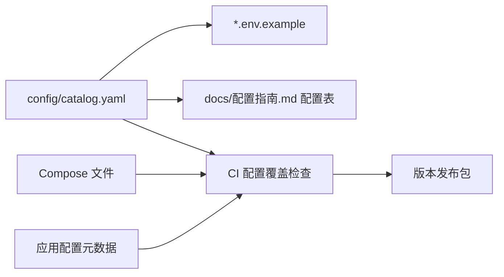

# YOOX Cloud GCS 配置指南与 API 指南同步交付规范

## 1. 目标

后期生成 YOOX Cloud GCS 项目时，必须在同一次生成过程中同时产出代码、容器配置、配置指南和
API 指南。文档属于可测试的版本制品，不是开发结束后补写的附件。

每个正式版本必须满足：

- 配置指南中的每个配置项都能追溯到 Compose、应用配置或基础服务配置。
- API 指南中的接口、事件、参数、示例和错误码与运行版本一致。
- 文档、镜像、数据库迁移、Compose 文件使用同一版本号和 Git Commit。
- CI 发现代码与文档漂移时直接阻止构建或发布。

## 2. 项目首次生成的必备文件

```text
YOOX_Cloud_GCS/
├── deploy/compose/
│   ├── compose.yaml
│   ├── compose.media.yaml
│   ├── compose.observability.yaml
│   ├── compose.ops.yaml
│   └── env/*.env.example
├── config/
│   ├── catalog.yaml               # 所有 YOOX 配置项的唯一目录
│   └── error-codes.yaml           # 错误码源文件
├── docs/
│   ├── 配置指南.md
│   ├── API指南.md
│   ├── 部署运维指南.md
│   └── CHANGELOG.md
├── openapi/
│   └── openapi.json
├── asyncapi/
│   └── asyncapi.yaml
├── examples/
│   ├── curl/
│   ├── websocket/
│   └── mqtt/
└── scripts/
    ├── generate-config-docs.*
    ├── generate-api-docs.*
    └── verify-docs.*
```

脚本可使用团队选定的跨平台实现，但 Windows、macOS、Linux 和 CI 的输出必须一致。

## 3. 配置唯一数据源

建议使用 `config/catalog.yaml` 维护 YOOX 自有配置元数据：

```yaml
items:
  - key: YOOX_API_DIAGNOSTIC_PORT
    service: yoox-api
    type: integer
    required: false
    default: 19000
    sensitive: false
    restart_required: true
    description: YOOX API 本机诊断端口
```

生成流程：



基础服务的原生配置项只在项目确实允许用户修改时加入目录，避免把所有中间件参数无差别暴露给用户。

## 4. 配置指南要求

`docs/配置指南.md` 至少包含：

1. 适用版本、镜像清单、Docker Engine 和 Docker Compose 最低版本。
2. 开发、测试、公有云、私有化和离线环境的配置差异。
3. Compose 文件组合、profiles、项目名称和节点角色。
4. 所有环境变量的名称、服务、类型、默认值、必填性、敏感性和重启影响。
5. P0 实际开放的 HTTP、MQTT、RTSP、WebRTC 和 TURN 端口；明确注明 RTMP、GB28181 未启用。
6. 域名、TLS、MQTT TLS、证书链和证书轮换。
7. MySQL、Redis、MinIO、EMQX、MediaMTX 和 coturn 配置；GB28181 Gateway 仅在后期启用版本加入。
8. 地图、离线瓦片、坐标系和数据目录。
9. Prometheus、Grafana、Loki、Alertmanager 和告警通知。
10. 数据卷、备份、恢复、升级、回滚和日志轮转。
11. 公有云与私有化的完整 `.env` 示例，但示例不得包含真实密钥。
12. 常见错误、健康检查、连通性验证和排障命令。

每项配置应明确“修改后是否需要重启容器”。Secret 只展示生成和注入方法，不展示实际值。

## 5. API 指南要求

`docs/API指南.md` 至少包含：

### 5.1 公共约定

- Base URL、API 版本、Content-Type 和字符集。
- 登录、Access Token、Refresh Token、注销和权限模型。
- 请求 ID、Trace ID、`Idempotency-Key`、超时和重试规则。
- 统一响应、错误码、分页、排序、过滤、时间和坐标格式。
- 限流、并发控制和接口弃用策略。

### 5.2 REST API

- 组织、项目、用户、角色。
- 设备、拓扑、能力、告警和日志。
- 直播会话、镜头、清晰度和停止直播。
- 虚拟座舱会话、控制权、心跳和退出。
- 航线、航线版本、任务和任务进度。
- 媒体、飞行记录和审计。
- 每个接口包含权限、请求、响应、错误、幂等和可运行示例。

### 5.3 WebSocket 与事件

- 连接、鉴权、订阅、心跳、重连和断点续传。
- 设备上线、OSD、直播状态、控制会话、任务进度和告警事件。
- `event_id`、`event_type`、`sequence`、`trace_id` 和版本兼容规则。
- 重复、乱序、丢失事件的客户端处理建议。

### 5.4 设备协议附录

- MQTT Topic、方向、QoS、消息方法和请求/应答关联。
- RTMP、RTSP、GB28181 三类设备推流能力、参数和差异。
- 协议能力表必须带实现状态：`RTSP=P0 已启用`、`RTMP=后期规划`、`GB28181=后期规划`。
- RTMP、GB28181 章节不得给出“当前可用”的配置或调用示例，直到对应版本真正实现并通过验收。
- 设备物模型与 YOOX 领域事件之间的映射。
- 该附录默认只在内部或授权环境发布，不进入普通第三方 OpenAPI。

## 6. OpenAPI 与 AsyncAPI

- REST 契约使用 OpenAPI 3.x，生成 `openapi/openapi.json`。
- WebSocket 和 MQTT 事件使用 AsyncAPI，生成 `asyncapi/asyncapi.yaml`。
- Swagger UI/ReDoc 和 API 指南中的端点表必须读取同一 OpenAPI 文件。
- 事件文档页面读取同一 AsyncAPI 文件。
- 契约示例必须脱敏，并可作为契约测试输入。
- 破坏性变更必须升级主版本；兼容新增升级次版本；修订只升级补丁版本。

## 7. 开发变更流程

### 7.1 新增配置项

同一个提交必须完成：

1. 更新 `config/catalog.yaml`。
2. 更新应用读取逻辑和 Compose 环境变量。
3. 重新生成 `.env.example` 和配置指南配置表。
4. 添加默认值、必填、敏感和重启影响测试。
5. 更新变更记录。

### 7.2 新增或修改 API

同一个提交必须完成：

1. 更新 OpenAPI 或后端契约源。
2. 更新实现、权限和错误码。
3. 更新 API 指南的业务说明与调用示例。
4. 添加契约测试、鉴权测试和示例测试。
5. 如涉及事件，同步更新 AsyncAPI。
6. 更新变更记录和兼容性说明。

### 7.3 删除配置或 API

- 先标记弃用并给出替代项和下线版本。
- 至少保留一个约定的兼容周期。
- 配置指南、API 指南和运行时响应都要显示弃用信息。
- 真正删除时执行破坏性变更评审。

## 8. CI 文档门禁

CI 至少执行：

- `docker compose config` 检查所有 Compose 组合可解析。
- Compose 使用的环境变量全部出现在配置目录。
- 配置目录中的变量全部出现在配置指南。
- OpenAPI 和 AsyncAPI 通过 Schema 校验。
- API 实现与 OpenAPI 路由、参数、状态码无漂移。
- 错误码源文件与代码、API 指南无漂移。
- curl/WebSocket/MQTT 示例可在 Compose 集成环境运行。
- Markdown 链接、代码围栏和文档版本有效。
- 重新生成文档后工作区无差异；有差异说明开发者漏交生成文件。

任一检查失败，禁止生成发布镜像和版本包。

## 9. 版本发布包

```text
YOOX-Cloud-GCS-<version>/
├── images/                         # 离线镜像归档
├── compose/                        # 全部 Compose 与环境模板
├── config/                         # 配置目录和基础服务模板
├── docs/
│   ├── 配置指南.pdf或html
│   ├── API指南.pdf或html
│   ├── 部署运维指南.pdf或html
│   └── CHANGELOG.md
├── openapi/openapi.json
├── asyncapi/asyncapi.yaml
├── examples/
├── scripts/
├── sbom/
├── checksums.txt
└── VERSION
```

`VERSION` 应记录版本号、Git Commit、构建时间、镜像 digest、Compose 版本、数据库版本、OpenAPI
版本和 AsyncAPI 版本。

## 10. 验收标准

- 从空仓库生成项目后，代码、Compose、配置指南和 API 指南同时存在。
- 使用配置指南可在全新 Docker 主机完成部署，不需要读取源码猜测配置。
- 使用 API 指南示例可完成登录、设备查询、开启/停止直播、座舱会话和航线任务流程。
- API 指南能查到 RTMP、RTSP、GB28181 三种协议能力，但只把 RTSP 标记为 P0 可用。
- 配置指南没有遗漏实际使用的环境变量。
- API 指南与 Swagger UI/ReDoc、WebSocket/MQTT 事件契约一致。
- 任意接口或配置变更都能被 CI 文档门禁检测。
- 离线发布包中的文档版本、镜像版本和 Compose 版本完全一致。
