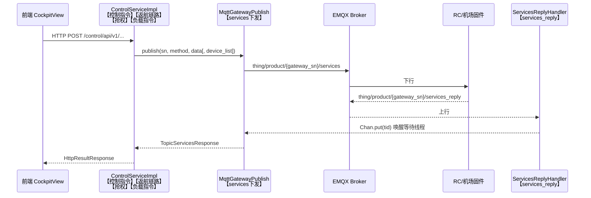

# 14. 指令链路诊断日志指南

> 2026-08-12 埋点并部署。用于排查 MQTT 控制指令失败，尤其是 **211001（The sending of mqtt message is abnormal / No message reply received）** 这类"设备无回复"问题。涉及指令：一键返航、取消返航、Look At、负载控制、抢权、指点飞行、一键起飞、紧急降落、强制降落等。

## 1. 指令链路总览

所有经后端的 services 指令走同一条链路，日志标签可逐级对账（关联键为 **tid**）：



**例外**：紧急降落 `drc_emergency_landing` / 强制降落 `drc_force_landing` 是**浏览器直发** MQTT 到 `thing/product/{gateway_sn}/drc/down`，不经过后端发送；回执在 `{gateway_sn}/services_reply` 上，后端仅以"无主回复"WARN 形式旁观（见 §2.2），主要诊断依据是前端 ◫ 交互日志面板（见 §3）。

## 2. 后端埋点明细

### 2.1 发送侧：`MqttGatewayPublish.publishWithReply`

文件：`yoox-framework/yoox-framework-mqtt/src/main/java/com/yoox/great/mqtt/core/produce/MqttGatewayPublish.java`

覆盖**所有** services 指令（默认 3 次尝试 × 3 秒超时，约 9 秒后抛 211001）。

| 日志 | 级别 | 触发时机 | 关键信息 |
|---|---|---|---|
| `【services下发】attempt=x/3 topic=... payload=...` | INFO | 每次（重）发布 | 完整报文 JSON：tid/bid/method/**data/device_list**，可直接核对字段是否符合固件预期 |
| `【services下发】收到匹配回复 ... 耗时=xxms` | INFO | 成功收到回复 | tid、耗时 |
| `【services下发】attempt=x/3 等待回复超时(3000ms)` | WARN | 单次等待超时 | topic/tid/bid |
| `【services下发】attempt=x/3 回复关联ID不匹配` | WARN | tid 匹配但 **bid 不一致**（原先被静默丢弃重试） | 期望与实际的 tid/bid |
| `【services下发】全部3次尝试均未收到回复，即将抛出211001` | ERROR | 最终失败 | 最后一次报文全文 |

### 2.2 接收侧：`ServicesReplyHandler.servicesReply`

文件：`yoox-framework/yoox-framework-mqtt/src/main/java/com/yoox/great/mqtt/handle/services/ServicesReplyHandler.java`

| 日志 | 级别 | 含义 |
|---|---|---|
| `【services_reply】topic=... method=... tid=... bid=... 原文=...` | INFO | 每条设备回复的完整原文 |
| `【services_reply】无主回复（无等待方，...）` | WARN | 回复到达时已无同步等待线程。两种可能：① **迟到回复**——设备回了但超过 9 秒，云端已按 211001 放弃（说明固件慢而非丢指令）；② **浏览器直发指令的回执**（如 drc_emergency_landing），属正常现象 |

### 2.3 业务入口：`ControlServiceImpl`

文件：`cloud-service/src/main/java/com/yoox/service/control/service/impl/ControlServiceImpl.java`

| 标签 | 方法 | 记录内容 |
|---|---|---|
| `【控制指令】` | `controlDockDebug`（return_home / return_home_cancel 等入口） | 请求 sn+method；网关离线拒绝；设备回复 result 与 success |
| `【返航链路】` | 同上 RETURN_HOME 分支 | 抢权失败即终止（含错误码）；下发前打印 gatewayDomain 与分支选择（RC 网关级无 device_list / 普通网关） |
| `【抢权】` | `seizeAuthority` | **缓存命中跳过发送**（重要：flight_authority_grab 平时被 `checkAuthorityFlight` 缓存挡住，缓存失效才真正发送——"平时正常"≠"该指令没问题"）；实际发送时的 domain/force；设备回复 result |
| `【负载指令】` | `payloadCommands`（camera_look_at 等） | 请求原始 data；幂等/无操作分支；**Jackson 实际序列化后的 data**（可核对 `payload_index`/`locked` 是否被 `@JsonIgnore` 丢掉——历史上 camera_look_at 就栽在这里）；分支选择（RC 带 device_list）；设备回复 result |

## 3. 前端埋点（紧急降落/强制降落）

文件：`web-console/src/views/CockpitView.vue`，查看入口：驾驶舱右下 **◫ 日志** 面板（记录 OUT/IN/INFO 全量 DRC 报文）。

| 记录 | 触发时机 |
|---|---|
| `drc_emergency_landing / drc_force_landing 回包被忽略：<原因>` | 原先静默 `return` 的所有分支：① 前端已超时或无待确认请求（迟到回包）；② 待确认方法与回包方法不一致；③ 本地请求 ID 已清空；④ **回包 topic 与期望不符**（期望 `thing/product/{网关SN}/services_reply`，若实际来自子飞机 SN 则是固件回复主题不一致的证据）；⑤ tid/bid 与请求 ID 不匹配。payload 含期望/实际值对照 |
| `... 等待回包超时（5s）` | 5 秒未匹配到回执，留存 method/requestId/gatewaySn/期望回复 topic |

## 4. 排查流程（211001 对账法）

```bash
# 实时观察（复现操作前先启动）
docker logs -f yoox-cloud-gcs-api-1 2>&1 | \
  grep -E "【services下发】|【services_reply】|【返航链路】|【负载指令】|【抢权】|【控制指令】"
```

1. 找到 `【services下发】attempt=1/3` 的 payload，记下 **tid**，核对 method/data/device_list 是否正确；
2. 按 tid 搜 `【services_reply】`：
   - **有**且 tid 匹配 → 看 result 判定业务失败原因；
   - **有但是"无主回复"** → 设备回了但超 9 秒，固件响应慢，考虑加大 timeout 或查设备负载；
   - **完全没有** → 指令被固件静默丢弃，按 §5 故障模式排查；
3. 紧急/强制降落：看前端 ◫ 日志面板的 OUT 报文与"被忽略/超时"记录，同时看后端是否出现该 method 的"无主回复"WARN（出现即证明设备有回执、问题在前端匹配规则）。

## 5. 已知 211001 根因速查（历史案例）

| # | 根因 | 判据 | 详情 |
|---|---|---|---|
| 1 | RC 下行缺 `device_list` | 无人机直达指令（takeoff_to_point/fly_to_point/负载类）payload 里没有 `device_list:[{sn:无人机SN}]` | 固件静默丢弃 |
| 2 | `data:null` 被固件丢弃 | return_home/return_home_cancel 发送 `data:null`（2026-08-12 A/B 实测：`data:{}`+device_list 秒回 result=0，`data:null` 任何写法零回复） | EVO RC 固件不接受 null data；文档"data 为 null、不带 device_list"不可信 |
| 3 | `data` 缺 `payload_index` | 负载指令序列化后的 data 没有 payload_index（对比 `【负载指令】实际data=` 日志） | RC 1.9.1.203 静默丢弃；字段以实测成功的同类指令为准，勿信文档示例 |
| 4 | SDKManager 内存注册丢失 | 日志出现 210001（Device is not registered）、`.../status` 消息计数为 0 而 `/osd` 高频 | 已加恢复钩子自愈，出现则查 `ApplicationBootInitial.recoverGatewayRegistration` |
| 5 | 操作员摇杆未回中 | 设备回复 result=514102（PULL_DRIVING_RODS_FAILED） | 非代码问题，需摇杆回中并交出飞控权 |
| 6 | 飞控权被缓存掩盖 | `【抢权】缓存命中，跳过发送` 后指令仍失败 | 缓存不代表设备侧认可，必要时 force 重抢 |
| 7 | **固件未实现该 method** | 同链路同时段对照指令（如 camera_screen_drag）秒回，而目标 method 的**所有报文变体**（字段增减、双 topic、need_reply 等）均零回复 | 2026-08-12 camera_look_at 案例：9 种变体实测全部被丢弃，结论为 RC 1.9.1.203 未实现；前端已降级为 camera_screen_drag 闭环兼容模式（反馈用 OSD gimbal_yaw/gimbal_pitch）。判定前必须先发对照指令排除链路/权限因素 |

## 6. 改动与部署注意

- 改 `yoox-framework/*` 后必须先 `mvn -B -DskipTests -pl yoox-framework/yoox-framework-mqtt -am install`，再重建 api 镜像，否则镜像内仍是旧 jar；
- 重建部署：`COMPOSE_BAKE=false docker compose --env-file .env build api web && docker compose --env-file .env up -d api web`；
- 所有埋点为 INFO/WARN/ERROR 常规级别，无需调整 logback 配置即可输出；`send topic:` 一类原有 DEBUG 日志不受影响；
- 前端日志仅写入浏览器本地交互日志面板（localStorage），不上传服务器。
