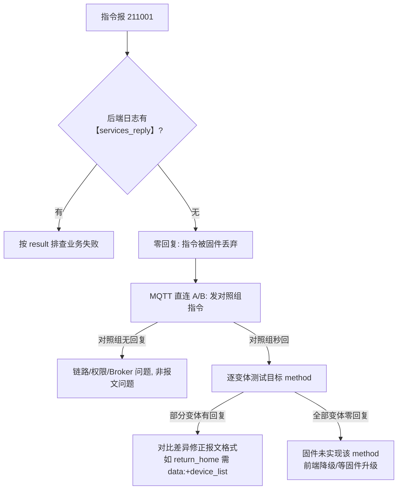

# 15. MQTT 直连 A/B 测试指南

> 适用于 EVO RC 遥控器网关（TH7926043417 / RC 固件 1.9.1.203）的 services 指令报文排查。
> 当云端报 **211001（The sending of mqtt message is abnormal / No message reply received）** 时，先用 `docs/14-指令链路诊断日志指南.md` 的日志对账法锁定"设备零回复"，再用本指南的 A/B 工具确定固件接受的报文格式。
> 配套脚本：`scripts/mqtt-services-abtest.py`（本文档 §3）。

## 1. 测试原理

云端发指令的完整链路是 `前端 → 后端业务层 → MqttGatewayPublish → EMQX → RC 固件`。211001 且 `【services_reply】` 无任何记录时，问题出在「报文格式被固件静默丢弃」或「固件未实现」。

**直连 A/B** 绕开全部云端代码：用 Python 客户端直连 EMQX（1883 端口，账号 `yoox-cloud`），直接向 `thing/product/{gateway_sn}/services` 发布候选报文，同时订阅网关与子飞机的 `services_reply`。**收到回复 = 固件接受该格式并真实执行**（result=0 即已生效）；零回复 = 该格式被丢弃。

关键约定（来自本文档 §4/§5 的实测）：

| 现象 | 结论 |
|---|---|
| 部分变体有回复，部分零回复 | 报文格式问题，对比差异（data 是否为对象、device_list 有无、字段增减） |
| **所有变体零回复，但对照组指令同秒秒回** | 固件未实现该 method，报文改造无解，需前端降级方案 |
| 子飞机 topic 才回复 | 固件回复主题与下发主题不一致，前端/后端订阅规则需兼容 |

## 2. 前置条件

- 本地栈运行中（`docker compose ps` 确认 emqx healthy）；
- MQQT 凭据取自项目根 `.env` 的 `YOOX_MQTT_USERNAME/PASSWORD`（脚本内置默认值与本地部署一致，生产环境请覆盖）；
- Python 环境可用 `docs/python-demo/.venv/bin/python`（已装 paho-mqtt）；
- **安全前提**：测试会真实触发指令。`return_home`/`fly_to_point`/`landing` 会改变飞行；`camera_look_at` 的 `locked:true` 可能联动机身航向，不能按普通相机参数测试看待。应由有资质人员在受控场地、满足设备手册安全条件时执行；当前无设备时只用 `--dry-run`。

## 3. 工具用法

脚本必须显式选择 `--dry-run`（只打印、不连接 MQTT）或 `--execute`（真实发布）。
默认读取项目根 `.env` 和 `docs/python-demo/.env`；命令行参数优先，也可用
`--env-file` 指定其他配置文件。不会把 MQTT 密码打印或写入结果文件。

```bash
# 1. 当前无设备时：离线生成 Look At 的完整 12 组字段矩阵。
# 2 payload_index × 3 locked（缺省/false/true）× 2 device_list；
# 前后各有一个 camera_screen_drag 对照报文，总计 14 条，发布数必须为 0。
docs/python-demo/.venv/bin/python scripts/mqtt-services-abtest.py \
  --method camera_look_at \
  --gateway TEST_GATEWAY --drone TEST_DRONE \
  --payload-index 10806-0-0 \
  --latitude 39.04187 --longitude 117.724655 --height 30 \
  --dry-run

# 2. 真机接入且完成飞行安全确认后，替换下方 SN 占位符并使用 --execute。
# 使用真实椭球高，不要传相对起飞点高度；默认只向网关 topic 发 12 组。
docs/python-demo/.venv/bin/python scripts/mqtt-services-abtest.py \
  --method camera_look_at \
  --gateway TH-xxx --drone 1748xxx \
  --payload-index 10806-0-0 \
  --latitude 39.04187 --longitude 117.724655 --height 30 \
  --host 127.0.0.1 --execute --output /tmp/look-at-abtest.json

# 3. 如需额外验证子飞机下发 topic，把 12 组在两个 topic 各跑一遍（共 24 组）。
... --method camera_look_at --topic-mode both ... --execute

# 4. 飞机在空中时应按用例 ID 分阶段测试，避免直接执行 locked=true。
# 可重复传 --case-id；前后 camera_screen_drag 对照仍会保留。
... --method camera_look_at --case-id LA-G-P1-L0-D1 ... --execute

# 要严格排除“尚未取得负载控制权”，可在同一 MQTT 连接中先抢权：
... --method camera_look_at --case-id LA-G-P1-L0-D1 \
  --grab-payload-authority --control-position before ... --execute

# 5. 通用 method 默认仍生成 data={} × device_list 有/无两组。
... --method return_home ... --execute
```

自动矩阵的用例 ID 形如 `LA-G-P1-L0-D1`：`G/D` 表示网关/子飞机 topic，
`P0/P1` 表示无/有 `payload_index`，`LX/L0/L1` 表示 `locked` 缺省/false/true，
`D0/D1` 表示无/有 `device_list`。变体 JSON 支持 `data`（null 或对象）、
`device_list`（bool）、`no_device_list: true`、`topic: gateway|drone`，以及用于
探测 `need_reply` 等字段的 `top_level` 对象。每组默认等待 4 秒（`--wait` 可调）。

脚本会等待 MQTT `CONNACK` 和两个 `services_reply` topic 的 `SUBACK` 后才发布，
并按 `tid + bid` 关联回复。若只有 `tid` 匹配但 `bid` 缺失/错误，会单独报告
`bid-mismatch`；当前后端同样会拒绝这种回复，最终仍可能表现为 211001。只有
前后两个对照都收到 `method/tid/bid` 匹配且 `result=0` 的回复，脚本才认为本轮
链路与权限基线成立；目标指令只要收到正确关联的回复，即使 result 非零，也能
证明该 method 没有被静默丢弃，下一步应按 result 排查业务条件。

## 4. 实测记录：return_home（2026-08-12）

**背景**：一键返航 211001。日志显示同分钟内 `fly_to_point`（data 对象 + device_list）31ms 秒回，而 `return_home`（data:null、无 device_list）零回复。

| # | data | device_list | 下发 topic | 回复 |
|---|---|---|---|---|
| A | `{}` | ✔ | 网关 | ✅ 31ms 内 result=0，**飞机真实返航** |
| B | `{}` | ✘ | 网关 | ❌ 零回复 |
| C | `null` | ✔ | 网关 | ❌ 零回复 |
| D（历史云端写法，8-11 前） | `null` | ✔ | 网关 | ❌ 零回复（历史复现） |
| E（历史云端写法，8-11 后） | `null` | ✘ | 网关 | ❌ 零回复（历史复现） |

**结论**：真凶是 `data:null` —— EVO RC 固件**拒绝一切 data 为 null 的报文**，无论带不带 device_list。正确格式为 `data:{}` + `device_list:[{sn:无人机SN}]`。此前"去 device_list"的修复（8-11 提交 984fc83）方向错误，真凶从未被单独验证（与 SDK 注册修复混在同一提交被掩盖）。

**落地**：`AbstractWaylineService.returnHomeRc/returnHomeCancelRc` 改为发送 `Map.of()` + device_list，测试断言见 `AbstractWaylineServiceRcCompatibilityTest.rcReturnHomeRcSendsEmptyDataWithDeviceList`。

## 5. 实测记录：camera_look_at（2026-08-12）

**背景**：Look At 指令 211001。云端已按历史教训补齐 `payload_index`/`locked`/device_list，仍零回复。为排除报文因素，对字段、topic、编码方式逐一排列组合。

> 源码校正：本仓库旁的原始 `Autel-Cloud-API` 中，`CameraLookAtRequest` 实际包含且
> `@NotNull` 要求 `payload_index` 与 `locked`；其 `cameraLookAt` 方法还明确标注
> `exclude = GatewayTypeEnum.RC`。因此“道通 Look At 没有这两个字段、支持 RC”不能
> 由这份 SDK 源码推出。下表是特定 RC 固件的历史实测记录，不等同于全部道通产品。

| # | data 字段组合 | device_list | 下发 topic | 回复 |
|---|---|---|---|---|
| A | 仅 `latitude/longitude/height`（纯文档格式） | ✔ | 网关 | ❌ |
| B | 同 A | ✘ | 网关 | ❌ |
| C | A + `payload_index` | ✔ | 网关 | ❌ |
| D | A + `locked:false` | ✔ | 网关 | ❌ |
| E | 完整字段（payload_index+locked+经纬高） | ✘ | **子飞机** | ❌ |
| F | 纯文档格式 | ✘ | **子飞机** | ❌ |
| G | A + `camera_type:zoom` | ✔ | 网关 | ❌ |
| H | A + `payload_index` + `locked`，height 整型 | ✔ | 网关 | ❌ |
| I | 同云端格式 + 顶层 `need_reply:1` | ✔ | 网关 | ❌ |
| 对照① `payload_authority_grab` | `{payload_index}` | ✔ | 网关 | ✅ result=0 |
| 对照② `camera_screen_drag` | `{payload_index,locked,pitch_speed:0,yaw_speed:0}` | ✔ | 网关 | ✅ result=0 |

**结论**：9 种 `camera_look_at` 变体**全部**被静默丢弃，而同一 MQTT 链路、同一秒发出的两组对照指令均秒回。**排除报文/权限/链路因素后，结论为 RC 固件 1.9.1.203 未实现 camera_look_at**，云端任何格式改造均无效。

当前脚本已把核心三维字段补成严格的 12 组笛卡尔积。以后复测应保存脚本汇总和
设备/RC 固件版本；在对照组未回复时，不得把目标组零回复归因于固件不支持。

**当前策略**：历史上曾因该结果把前端降级为 `camera_screen_drag` 闭环兼容；现已按操作要求恢复原生 `camera_look_at`。地图 Look At 会发送 `payload_index`、`locked:false`、目标经纬度和椭球高；RC 分支由后端补顶层 `device_list`。若目标固件行为仍与上述历史记录一致，界面会继续收到 211001，此时应使用本文脚本复测并保存固件版本与汇总结果。

### 5.1 RC 固件 1.9.1.217 复测（2026-08-14）

飞机悬停期间仅执行了不会明确联动机身的安全子矩阵，未发送 `locked:true`：

- 网关 `services` Topic；当前实际飞机与 `payload_index=10806-0-0`；
- `payload_index` 有/无 × `locked` 缺省/false × `device_list` 有/无，共 8 组；
- 8 组 `camera_look_at` 全部在 2–4 秒窗口内无同 `tid` 回复；
- 每批前后 `camera_screen_drag` 零速度对照均返回 `result=0`，延迟 30–309 ms；
- 又在同一 MQTT 连接内按顺序发送 `payload_authority_grab` → 零速度
  `camera_screen_drag` → 标准 `camera_look_at`；前两条分别在 205 ms、38 ms
  返回 `result=0`，而携带 `payload_index`、`locked:false`、`device_list` 的
  Look At 在 4 秒内仍无同 `tid` 回复；
- 云台 OSD 未显示 Look At 动作，飞机保持悬停。

因此在 RC 固件 `1.9.1.217` 上再次确认：链路、Topic、负载索引和负载控制权均正常，
但 `camera_look_at` 被固件静默丢弃。结合原始 SDK 的
`@CloudSDKVersion(... exclude = GatewayTypeEnum.RC)`，**当前 RC 场景不存在能够成功的
`camera_look_at` JSON 写法**。要实现地图 Look At，只能使用
`camera_screen_drag` + 云台 OSD 角度反馈闭环、改用 SDK 支持的非 RC 网关，或等待固件新增该 method。

## 6. 判定流程总结



经验教训（供后续 agent 参考）：

1. **先对照再归因**：判定"固件不支持"前必须用已知成功的 method 验证链路，否则会把报文/权限问题误判为不支持；
2. **多修复混在同一提交会掩盖未验证的修复**（8-11 的 device_list 修复即是教训），每个修复配一个可回归的断言测试；
3. **离线文档的 Example 不可信**：return_home 的 "Data: null"、camera_look_at 的数据字段均以实测为准，文档示例只能作为起点；
4. A/B 脚本会真实触发指令，`result=0` 回复即设备已执行，测试环境务必保持飞机安全状态。
