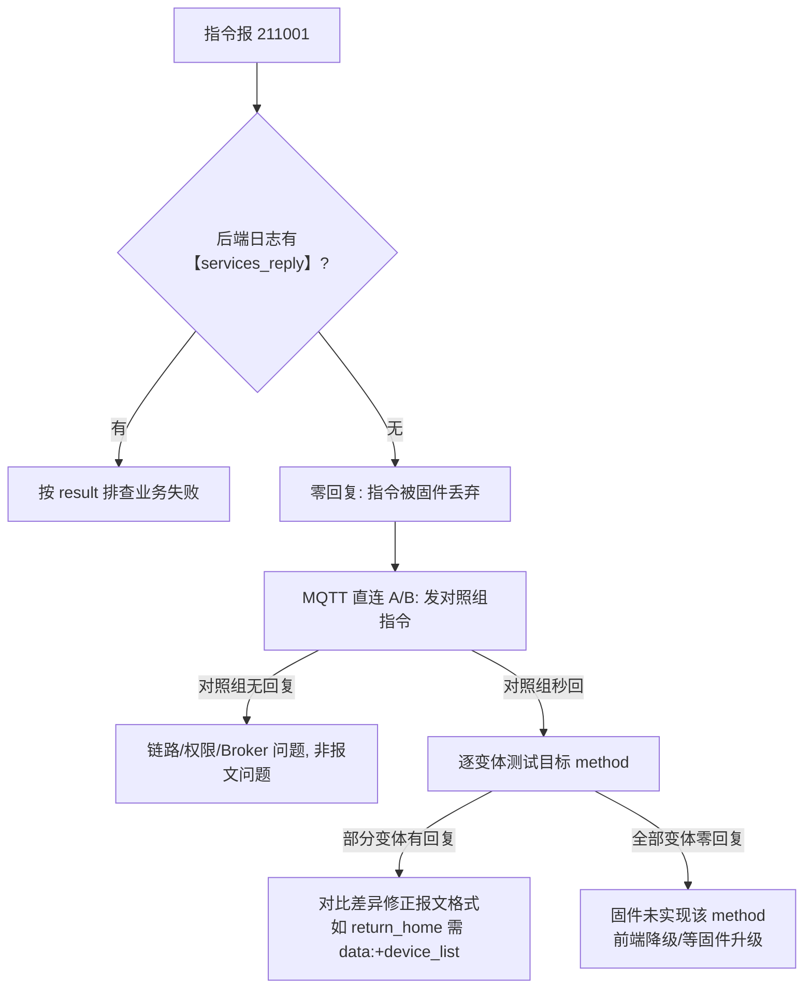

# 15. MQTT 直连 A/B 测试指南

> 适用于 EVO RC 遥控器网关（TH7926043417 / RC 固件 1.9.1.203）的 services 指令报文排查。
> 当云端报 **211001（The sending of mqtt message is abnormal / No message reply received）** 时，先用 `docs/14-指令链路诊断日志指南.md` 的日志对账法锁定"设备零回复"，再用本指南的 A/B 工具确定固件接受的报文格式。
> 配套脚本：`scripts/mqtt-services-abtest.py`（本文档 §3）。

## 1. 测试原理

云端发指令的完整链路是 `前端 → 后端业务层 → MqttGatewayPublish → EMQX → RC 固件`。211001 且 `【services_reply】` 无任何记录时，问题出在「报文格式被固件静默丢弃」或「固件未实现」。

**直连 A/B** 绕开全部云端代码：用 Python 客户端直连 EMQX（1883 端口，账号 `yoox-cloud`），直接向 `thing/product/{gateway_sn}/services` 发布候选报文，同时订阅网关与子飞机的 `services_reply`。**收到回复 = 固件接受该格式并真实执行**（result=0 即已生效）；零回复 = 该格式被丢弃。

关键约定（来自本文档 §4/§5 的实测）：

| 现象 | 结论 |
|---|---|
| 部分变体有回复，部分零回复 | 报文格式问题，对比差异（data 是否为对象、device_list 有无、字段增减） |
| **所有变体零回复，但对照组指令同秒秒回** | 固件未实现该 method，报文改造无解，需前端降级方案 |
| 子飞机 topic 才回复 | 固件回复主题与下发主题不一致，前端/后端订阅规则需兼容 |

## 2. 前置条件

- 本地栈运行中（`docker compose ps` 确认 emqx healthy）；
- MQQT 凭据取自项目根 `.env` 的 `YOOX_MQTT_USERNAME/PASSWORD`（脚本内置默认值与本地部署一致，生产环境请覆盖）；
- Python 环境可用 `docs/python-demo/.venv/bin/python`（已装 paho-mqtt）；
- **安全前提**：测试会真实触发指令。`return_home`/`fly_to_point`/`landing` 类指令会实际改变飞行，测试前确认飞机悬停或在地面；`camera_*` 与 `*_grab` 类指令无飞行风险。

## 3. 工具用法

```bash
# 1. 通用探测：对指定 method 发「空 data + device_list / 无 device_list」两变体 + 对照指令
docs/python-demo/.venv/bin/python scripts/mqtt-services-abtest.py --method return_home

# 2. 自定义变体（字段全组合、子飞机 topic、空 data 与否）
docs/python-demo/.venv/bin/python scripts/mqtt-services-abtest.py \
  --method camera_look_at \
  --variant '{"data": {"latitude": 39.04187, "longitude": 117.724655, "height": 10}}' \
  --variant '{"data": {"payload_index": "10806-0-0", "latitude": 39.04187, "longitude": 117.724655, "height": 10}}' \
  --variant '{"data": {"latitude": 39.04187, "longitude": 117.724655, "height": 10}, "drone_topic": true}'

# 3. 设备 SN / broker 不同时覆盖默认值
... --gateway TH-xxx --drone 1748xxx --host 127.0.0.1
```

变体 JSON 支持的键：`data`（null 或对象）、`no_device_list: true`（去掉 device_list）、`drone_topic: true`（发到子飞机 topic）。每个变体默认等回复 4 秒（`--wait` 可调）。

## 4. 实测记录：return_home（2026-08-12）

**背景**：一键返航 211001。日志显示同分钟内 `fly_to_point`（data 对象 + device_list）31ms 秒回，而 `return_home`（data:null、无 device_list）零回复。

| # | data | device_list | 下发 topic | 回复 |
|---|---|---|---|---|
| A | `{}` | ✔ | 网关 | ✅ 31ms 内 result=0，**飞机真实返航** |
| B | `{}` | ✘ | 网关 | ❌ 零回复 |
| C | `null` | ✔ | 网关 | ❌ 零回复 |
| D（历史云端写法，8-11 前） | `null` | ✔ | 网关 | ❌ 零回复（历史复现） |
| E（历史云端写法，8-11 后） | `null` | ✘ | 网关 | ❌ 零回复（历史复现） |

**结论**：真凶是 `data:null` —— EVO RC 固件**拒绝一切 data 为 null 的报文**，无论带不带 device_list。正确格式为 `data:{}` + `device_list:[{sn:无人机SN}]`。此前"去 device_list"的修复（8-11 提交 984fc83）方向错误，真凶从未被单独验证（与 SDK 注册修复混在同一提交被掩盖）。

**落地**：`AbstractWaylineService.returnHomeRc/returnHomeCancelRc` 改为发送 `Map.of()` + device_list，测试断言见 `AbstractWaylineServiceRcCompatibilityTest.rcReturnHomeRcSendsEmptyDataWithDeviceList`。

## 5. 实测记录：camera_look_at（2026-08-12）

**背景**：Look At 指令 211001。云端已按历史教训补齐 `payload_index`/`locked`/device_list，仍零回复。为排除报文因素，对字段、topic、编码方式逐一排列组合。

| # | data 字段组合 | device_list | 下发 topic | 回复 |
|---|---|---|---|---|
| A | 仅 `latitude/longitude/height`（纯文档格式） | ✔ | 网关 | ❌ |
| B | 同 A | ✘ | 网关 | ❌ |
| C | A + `payload_index` | ✔ | 网关 | ❌ |
| D | A + `locked:false` | ✔ | 网关 | ❌ |
| E | 完整字段（payload_index+locked+经纬高） | ✘ | **子飞机** | ❌ |
| F | 纯文档格式 | ✘ | **子飞机** | ❌ |
| G | A + `camera_type:zoom` | ✔ | 网关 | ❌ |
| H | A + `payload_index` + `locked`，height 整型 | ✔ | 网关 | ❌ |
| I | 同云端格式 + 顶层 `need_reply:1` | ✔ | 网关 | ❌ |
| 对照① `payload_authority_grab` | `{payload_index}` | ✔ | 网关 | ✅ result=0 |
| 对照② `camera_screen_drag` | `{payload_index,locked,pitch_speed:0,yaw_speed:0}` | ✔ | 网关 | ✅ result=0 |

**结论**：9 种 `camera_look_at` 变体**全部**被静默丢弃，而同一 MQTT 链路、同一秒发出的两组对照指令均秒回。**排除报文/权限/链路因素后，结论为 RC 固件 1.9.1.203 未实现 camera_look_at**，云端任何格式改造均无效。

**落地**：前端不再下发 `camera_look_at`，改用 `camera_screen_drag` 速度闭环兼容模式（`runLookAtCompatLoop`）：OSD `gimbal_yaw`/`gimbal_pitch` 做反馈、目标 GPS 算方位/俯仰、比例控制收敛到 1.5° 内。

## 6. 判定流程总结



经验教训（供后续 agent 参考）：

1. **先对照再归因**：判定"固件不支持"前必须用已知成功的 method 验证链路，否则会把报文/权限问题误判为不支持；
2. **多修复混在同一提交会掩盖未验证的修复**（8-11 的 device_list 修复即是教训），每个修复配一个可回归的断言测试；
3. **离线文档的 Example 不可信**：return_home 的 "Data: null"、camera_look_at 的数据字段均以实测为准，文档示例只能作为起点；
4. A/B 脚本会真实触发指令，`result=0` 回复即设备已执行，测试环境务必保持飞机安全状态。
