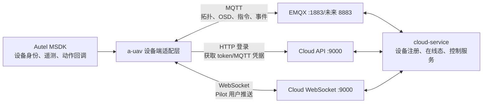
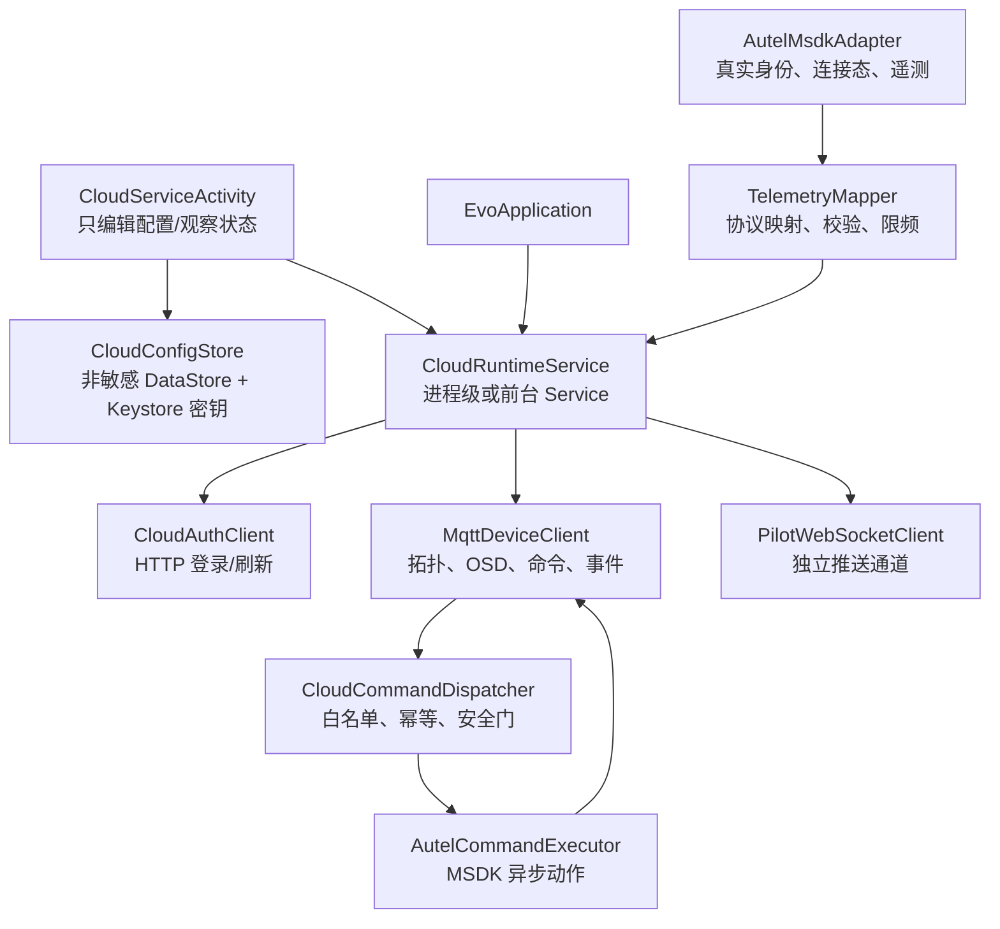

# 16. a-uav 上云服务接入分析与实施方案

> 评审日期：2026-08-20
> 上云 API 基线：`YOOX_Cloud_GCS@e229836901d3`
> 遥控器 APP 基线：`a-uav@ffdeda84650a`，分支 `feature/cloud-service`
> 目标读者：Android/MSDK、云端后端、测试与部署人员

## 1. 结论先行

`a-uav/feature/cloud-service` 当前实现的方向在“验证传输链路”这一层基本正确：HTTP Pilot 登录、MQTT 上线 Topic、`update_topo` 主要字段以及 WebSocket 的实际鉴权方式都与当前上云 API 源码相符，Android 分支也可以正常编译。

但它目前只是一个 **登录 + MQTT 建连并发送一次测试拓扑 + WebSocket 握手** 的连通性原型，不是完整上云服务，不能直接作为生产版本使用。主要缺口是：

- 没有读取 MSDK 的真实遥控器/飞机身份和飞行数据；
- 没有持续上报 RC、飞机 OSD，设备上线后约 30～60 秒会被云端判离线；
- 没有订阅 MQTT 下行 Topic、执行 MSDK 指令和发送 `services_reply`；
- 连接归配置 Activity 所有，退出配置页就主动断云；
- 没有断线感知、重连、重订阅、拓扑 ACK 校验和可靠状态机；
- 使用固定测试 SN、共享账号和明文传输，存在设备冲突与凭据泄露风险；
- 自动连接、自动上传照片目前只有 UI 和偏好值，没有业务实现。

对“能否连接当前上云 API 服务”的准确回答是：

1. **源码协议层面可以接入，不需要推翻现有云端协议。** 应在 `a-uav` 内新增 MSDK 到现有私有协议的设备端适配层。
2. **现网目前不能完成完整三通道连接。** 2026-08-20 从开发机实测，健康检查、Pilot 登录和 WebSocket 握手可用，但公网 `124.220.168.49:1883` 拒绝 TCP 连接；登录还返回了容器内地址 `tcp://emqx:1883`。
3. **即便先修通 MQTT，当前 APP 也只会短暂上线，不能持续遥测或接受控制。** 必须按本文的阶段 0、阶段 1 完成后，才能称为“只读上云 MVP”；控制能力还需要阶段 2 的安全闭环。

### 1.1 兼容性总表

| 能力 | 当前判断 | 说明 |
|---|---|---|
| Pilot HTTP 登录 | 兼容 | 路径、`flag=2`、请求和返回字段匹配，现网实测成功 |
| WebSocket 握手 | 兼容 | 实际接口是 `/api/v1/ws?x-auth-token=...`，现网返回 101 |
| MQTT 账号及 Topic 结构 | 源码兼容、现网不可达 | 客户端协议方向正确，但公网 1883 当前拒绝连接 |
| 拓扑上线 | 部分兼容 | 只发一次测试拓扑，不订阅和校验 `status_reply` |
| 真实设备身份 | 不兼容 | 当前使用固定 RC/飞机测试 SN 和固定机型 |
| 在线续期与 OSD | 未实现 | MQTT keepalive 不能替代云端的业务在线 TTL 续期 |
| 云端控制闭环 | 未实现 | 无订阅、命令分发、MSDK 执行、应答与幂等 |
| 后台生命周期 | 不兼容 | Activity 销毁时会断开 MQTT 和 WebSocket |
| 弱网恢复 | 未实现 | MQTT 自动重连被关闭，WS 断开后也不恢复 |
| 媒体、航线、直播、DRC | 未实现 | 不应计入当前分支完成度 |
| 生产安全 | 不满足 | 明文链路、共享宽权限账号、明文存储和敏感日志 |

建议把当前分支标记为 `cloud connectivity spike`，保留配置页面和部分 JSON 模型，重构连接内核，不应在现有 `CloudConnectionManager` 上继续堆叠全部设备能力。

## 2. 评审范围、依据与限制

本次采用三类证据交叉核对：

1. 上云 API 源码：登录鉴权、MQTT Topic 路由、设备注册、在线 TTL、OSD、下行服务和部署配置；
2. `a-uav` 源码：`feature/cloud-service` 增量、现有 MSDK 数据源、应用生命周期和 Android 网络配置；
3. 运行态验证：对当前公网地址进行健康检查、登录、WebSocket Upgrade、MQTT TCP 端口探测，并编译 Android 分支。

评审基线：

| 项目 | 分支/提交 | 备注 |
|---|---|---|
| `YOOX_Cloud_GCS` | `e229836901d3` | 当前工作区另有用户未提交改动，本评审未修改这些文件 |
| `a-uav` | `feature/cloud-service@ffdeda84650a` | 本地比 `origin/feature/cloud-service` 超前 1 个提交 |
| `a-uav main` | `780fb31946a7` | `main...HEAD` 共 14 个文件，约 `+1234/-2` |

注意：远端 `origin/feature/cloud-service` 当前只包含配置 UI，实际 HTTP/MQTT/WS 连接逻辑位于尚未推送的本地提交 `ffdeda8`。团队协作前应先明确是否推送、重构或拆分该提交。

运行态结论只代表 2026-08-20 从当前开发网络到公网目标的结果。未登录生产主机核对容器版本，也没有在真实道通遥控器和飞机上执行飞行指令，因此不能把本报告当作实机飞行验收记录。

## 3. 当前云端协议如何工作

### 3.1 三条链路职责不同



- **HTTP** 是 Pilot 身份登录入口，返回 JWT、workspace 和 MQTT 凭据；
- **MQTT** 是设备数据面和设备控制面，是 RC/飞机在线、遥测和控制闭环的核心；
- **WebSocket** 是 Pilot 用户推送通道，不是设备在线的替代品。WS 故障可以让会话进入 `DEGRADED`，但不应把健康的 MQTT 设备数据面一并断开。

### 3.2 登录和鉴权约定

登录请求：

```http
POST /manage/api/v1/login
Content-Type: application/json

{
  "username": "<pilot-account>",
  "password": "<redacted>",
  "flag": 2
}
```

关键返回字段为：

- `access_token`
- `mqtt_addr`
- `mqtt_username`
- `mqtt_password`
- `workspace_id`
- `user_id`
- `user_type`

普通 HTTP API 使用请求头 `x-auth-token`；当前 WebSocket 实现使用查询参数：

```text
/api/v1/ws?x-auth-token=<access_token>
```

`api-portal` 中仍存在 `/cloud/api/v1/ws?access_token=...` 的旧示例，与实际源码和现网行为不一致，应一并修正文档，避免客户端照错协议实现。

### 3.3 MQTT Topic 契约

下表是 `a-uav` MVP 需要覆盖的最小 Topic 集。`{gateway_sn}` 是真实遥控器 SN，`{device_sn}` 是遥控器或所连接飞机的真实 SN。

| 方向 | Topic | 用途 | MVP |
|---|---|---|---|
| APP → 云 | `sys/product/{gateway_sn}/status` | `update_topo` 上/下线拓扑 | 必须 |
| 云 → APP | `sys/product/{gateway_sn}/status_reply` | 确认拓扑是否被接受 | 必须 |
| APP → 云 | `thing/product/{device_sn}/osd` | RC、飞机周期遥测并刷新在线 TTL | 必须 |
| APP → 云 | `thing/product/{device_sn}/state` | 低频能力/状态变化 | 按需 |
| 云 → APP | `thing/product/{gateway_sn}/services` | 云端下行控制 | 控制阶段必须 |
| APP → 云 | `thing/product/{gateway_sn}/services_reply` | MSDK 执行结果 | 控制阶段必须 |
| APP → 云 | `thing/product/{gateway_sn}/events` | 长任务进度和主动事件 | 按能力实现 |
| 云 → APP | `thing/product/{gateway_sn}/events_reply` | 事件确认 | 按能力实现 |
| 云 → APP | `thing/product/{gateway_sn}/property/set` | 属性设置 | 按能力实现 |
| APP → 云 | `thing/product/{gateway_sn}/property/set_reply` | 属性设置结果 | 按能力实现 |
| 云 → APP | `thing/product/{gateway_sn}/drc/down` | 高频 DRC 控制 | 最后阶段 |
| APP → 云 | `thing/product/{gateway_sn}/drc/up` | DRC 状态/应答 | 最后阶段 |

云端 MQTT JSON 采用 snake_case。一般关联字段为 `tid`、`bid`、`timestamp`，OSD 还必须携带根字段 `gateway`。下行服务应答必须原样回显请求的 `tid`、`bid` 和 `method`：

```json
{
  "tid": "<same-as-request>",
  "bid": "<same-as-request>",
  "timestamp": 1787184000000,
  "method": "return_home",
  "data": {
    "result": 0,
    "output": {}
  }
}
```

### 3.4 设备在线不是 MQTT keepalive

云端设备在线缓存 TTL 为 60 秒，调度任务每 30 秒检查一次，并会把剩余 TTL 不超过 30 秒的设备判离线。`update_topo` 只负责创建/绑定拓扑；持续 OSD 等业务消息才会续期在线状态。

因此当前 APP 只发一次 `update_topo` 的结果是：即使 MQTT 连接一直存在，设备也会在约 30～60 秒后从业务上离线。建议 APP 以 1～2 Hz 发布飞机 OSD，以 1 Hz 发布 RC OSD；连续 10 秒无有效遥测时应进入 `TELEMETRY_STALE`，不能继续向云端伪造新鲜数据。

关键服务端证据：

- `yoox-framework-redis/.../RedisConst.java:12`：在线 TTL 为 60 秒；
- `cloud-service/.../GlobalScheduleService.java:32`：30 秒周期离线检查；
- `cloud-service/.../SDKDeviceService.java:402`：OSD 路由刷新在线状态；
- `yoox-framework-mqtt/.../OsdRemoteControl.java:7`：RC OSD 模型；
- `yoox-framework-mqtt/.../OsdRcDrone.java:11`：RC 所连飞机 OSD 模型。

## 4. `feature/cloud-service` 代码评审

### 4.1 已做对的部分

以下代码可以作为后续重构的参考或保留：

- `CloudConnectionManager.doHttpLogin()` 的请求路径、`flag=2` 和返回字段解析正确；
- WebSocket 使用 `/api/v1/ws?x-auth-token=...`，与实际服务端一致；
- 上线 Topic `sys/product/{gatewaySn}/status` 和 `method=update_topo` 正确；
- RC `domain/type/sub_type=2/20119/0`、EVO MAX 飞机 `0/11000/0` 与服务端枚举匹配；
- 云服务配置页、工具栏入口以及按 `identifier` 合并旧配置的思路可保留；
- `./gradlew :app:compileDebugKotlin` 于本次评审中执行成功。

这说明当前分支适合用来证明“APP 可以按现有协议发起握手”，但不能证明“设备已经可靠上云”。

### 4.2 P0：不解决就不能定义为上云 MVP

| 问题 | 影响 | 代码证据 | 必须修改 |
|---|---|---|---|
| Activity 持有连接 | 离开配置页即断云，飞行主页无法保持连接 | `CloudServiceActivity.kt:62,265` | 迁移到进程级/前台 `CloudRuntimeService` |
| 固定测试 SN 和机型 | 多台 RC 互踢 MQTT，云端身份与真实飞机不一致 | `CloudServiceActivity.kt:77,197` | 从 MSDK 读取真实 RC/飞机 SN、型号 |
| 无 MSDK 数据接入 | 无真实遥测、设备状态和动作回调 | 云模块未引用 MSDK 数据源 | 新建 `AutelDeviceRepository` 与 Mapper |
| 无 OSD | 30～60 秒后业务离线 | `CloudConnectionManager.kt:167` 只发一次拓扑 | 周期发布 RC/飞机 OSD |
| 无订阅/回调 | 所有云端控制均不执行，最终 211001 | `doMqttConnect()` 无 callback/subscribe | 先订阅再上线，实现命令闭环 |
| 不校验 `status_reply` | 拓扑被拒绝时 UI 仍显示成功 | `CloudConnectionManager.kt:86-95` | 只有 ACK `result=0` 才进入 ONLINE |
| 敏感信息进日志 | JWT 和 MQTT 密码可能被日志导出 | `CloudConnectionManager.kt:145,229` | 全链路日志脱敏，禁止记录响应体/token URL |
| 明文共享凭据 | 可窃听，且 Pilot ACL 可冒充任意 SN | Android 默认配置、`deploy/emqx/acl.conf` | TLS/VPN、设备独立凭据、按 SN 最小 ACL |

项目已有可复用的 MSDK 能力，但建议复用“取值方式”，不要让后台服务直接依赖 Activity 的 ViewModel：

- `EvoApplication.kt:84`：进程级设备连接生命周期；
- `SharedAppViewModel.kt:513`：MSDK 监听注册方式；
- `SharedAppViewModel.kt:857`：5 Hz/2 Hz 飞行状态；
- `DeviceManagerUtils.kt:334`：飞机与遥控器真实设备信息/SN；
- `DeviceManagerUtils.kt:223`：已有降落、返航等动作封装可参考。

### 4.3 P1：可靠性和配置缺陷

1. `isConnected()` 只检查 MQTT，未检查拓扑 ACK、遥测健康和命令订阅；
2. MQTT 明确关闭自动重连，且没有 `connectionLost` 回调；
3. 首次 WS 握手后，`onFailure`/`onClosed` 只写日志，不更新状态或重连；
4. WS 失败时已建立的 MQTT 不清理，重试可能产生同 client ID 抢占；
5. 登录解析了 `mqtt_addr` 和 `workspace_id`，连接时却忽略 `mqtt_addr`，强制使用页面 host + 1883；
6. `cleanSession=true` 本身可以接受，但每次重连必须重新订阅、重新上线并等待 ACK，当前均未实现；
7. 连接线程不可取消，Activity 在登录期间销毁后，后台线程仍可能继续创建连接并回调已销毁页面；
8. Android 明文网络白名单只包含固定公网 IP 和 localhost，配置其他局域网地址或域名可能被系统直接拒绝；
9. graceful disconnect 没有主动发送空 `sub_devices` 的离线拓扑，也没有 MQTT Last Will；
10. 成功路径没有复位 `connecting`，状态管理容易长期失真。

### 4.4 P2：功能开关和 UI 问题

- “自动连接”正常启动时没有执行逻辑，仅 ADB Intent extra 会触发一次；
- “自动上传照片”没有媒体监听、上传 URL、队列、重试或回调；
- 登录/MQTT 密码保存在普通 SharedPreferences，且应用允许备份；
- 折叠逻辑会把包含折叠按钮自身的根内容设为 `GONE`，页面无法再次展开；
- 展开和折叠状态设置了相同箭头资源；
- 没有新增云连接单元测试或仪器测试。

## 5. 现网验证显示 MQTT 是当前部署阻断项

2026-08-20 使用脱敏脚本从当前开发网络验证公网目标，结果如下：

| 检查 | 结果 | 判断 |
|---|---|---|
| `GET http://124.220.168.49:9000/actuator/health` | HTTP 200 | API 服务在线 |
| `POST /manage/api/v1/login` | `code=0`，返回 JWT/workspace/MQTT 凭据 | Pilot 登录可用 |
| 登录返回的 `mqtt_addr` | `tcp://emqx:1883` | 错误地暴露了 Docker 内部主机名 |
| `GET /api/v1/ws?x-auth-token=<redacted>` Upgrade | HTTP 101 | APP 当前 WS 路径正确 |
| TCP `124.220.168.49:1883` | `Connection refused` | 遥控器当前无法从公网连接 MQTT |

此外，仓库自带的示例 Pilot 凭据仍能登录公网服务。报告不记录具体密码，但生产环境应立即轮换默认凭据并审计使用记录。

`compose.yml` 的当前源码本来会通过 `YOOX_MQTT_ADVERTISED_ADDRESS` 返回外部 Broker URI，也会映射 1883。因此现网行为说明至少存在以下一种情况：

- 生产 `.env` 未设置或错误设置外部 MQTT 地址；
- 远端仍在运行旧 compose/旧镜像；
- EMQX 容器未启动或没有映射 1883；
- 主机防火墙/云安全组未允许遥控器来源访问；
- API 容器回退到了内部配置 `tcp://emqx:1883`。

需要在生产主机只读核对后再修复：

```bash
docker compose ps
docker compose logs --tail=200 emqx cloud-service
ss -lntp
docker compose config
```

期望配置至少满足：

```dotenv
YOOX_PUBLIC_HOST=124.220.168.49
YOOX_MQTT_PORT=1883
YOOX_MQTT_ADVERTISED_ADDRESS=tcp://124.220.168.49:1883
```

上述是当前协议的临时可用配置。生产目标应是域名 + TLS（例如 MQTTS 8883）或受控 VPN，不应长期裸露公网明文 1883。

## 6. `a-uav` 推荐目标架构

### 6.1 连接内核必须脱离配置页面



建议的 Kotlin 组件边界：

| 组件 | 单一职责 |
|---|---|
| `CloudRuntimeService` | 生命周期、总状态机、网络恢复、启动/停止所有通道 |
| `CloudSessionStateMachine` | 显式维护认证、MQTT、拓扑、遥测、命令、WS 状态 |
| `CloudAuthClient` | Pilot 登录、token 有效期、返回 URI/凭据解析 |
| `MqttDeviceClient` | 单实例连接、订阅、发布、LWT、退避重连、Topic 路由 |
| `PilotWebSocketClient` | Pilot 推送解析与独立重连，不拥有设备在线态 |
| `AutelMsdkAdapter` | 从 MSDK 暴露稳定的身份、遥测流和连接事件 |
| `TelemetryMapper` | MSDK DTO → 云协议 DTO，过滤无效坐标并限频 |
| `CloudCommandDispatcher` | JSON 校验、SN 校验、method 白名单、幂等与超时 |
| `AutelCommandExecutor` | 把 method 映射为 MSDK 异步调用和结果 |
| `CloudConfigStore` | 保存 API bootstrap 配置；密钥由 Android Keystore 保护 |
| `CloudDiagnostics` | 脱敏状态、重连次数、最后 OSD/命令/错误时间 |

如果遥控器系统不允许常规 Android 前台服务，最低要求也是由 `EvoApplication` 持有进程级单例，配置 Activity 只能观察它，绝不能在 `onDestroy()` 中断云。

### 6.2 使用明确状态机，禁止“MQTT 连上即成功”

推荐状态：

```text
DISABLED
  → WAITING_FOR_MSDK
  → AUTHENTICATING
  → CONNECTING_MQTT
  → SUBSCRIBING
  → TOPOLOGY_PENDING
  → ONLINE
  ↘ DEGRADED_WS / TELEMETRY_STALE
  ↘ RECONNECTING
  → STOPPING → DISABLED
```

进入 `ONLINE` 必须同时满足：

- 真实 RC SN 已取得且通过协议格式校验；
- MQTT CONNACK 成功；
- 必需下行 Topic SUBACK 成功；
- `update_topo` 对应 `status_reply.data.result == 0`；
- 至少产生一帧有效飞机/RC 状态；
- OSD 发布器已运行。

UI 应分别显示 `brokerConnected`、`topologyAccepted`、`telemetryHealthy`、`commandReady` 和 `webSocketConnected`，不要用一个模糊的“已连接”覆盖所有状态。

## 7. 正确的连接与上线流程

建议严格按以下顺序实现：

1. `EvoApplication` 监听 MSDK 注册和设备连接，等待真实 RC 信息；
2. 从 MSDK 取得真实 RC SN、飞机 SN、设备型号和连接关系，拒绝空值与测试 SN；
3. 校验 SN 满足当前服务端 `[A-Za-z0-9]+`。若真实硬件 SN 含其他字符，不得客户端静默改写，需同步扩展服务端协议或建立受控映射；
4. 使用 API bootstrap 地址登录，`flag=2`，日志只记录 HTTP 状态和脱敏错误；
5. 解析并优先使用服务端返回的 `mqtt_addr`、`mqtt_username`、`mqtt_password`。手工 Broker override 只允许在 debug 构建启用；
6. 以真实 RC SN 生成唯一 client ID，例如 `auav-<rc_sn>`，同一进程只允许一个连接实例；
7. 设置 LWT 为离线拓扑或至少使用可靠断线检测，连接 MQTT；
8. 先订阅 `status_reply`、`services`、`property/set` 等 Topic，并等待全部 SUBACK；
9. 发布真实 `update_topo`，用 `tid+bid` 关联 `status_reply`；
10. 只有 `result=0` 后启动 RC/飞机 OSD 发布器并进入 `ONLINE`；
11. 独立建立 WebSocket。WS 失败时记录降级状态并重连，不中断 MQTT；
12. 网络切换或 MQTT 断开后指数退避重连，重新登录（需要时）、重新订阅、重新上线；
13. 正常停止时发布空 `sub_devices` 的离线拓扑，等待短暂发送完成后再断开；
14. MSDK 飞机断开时更新拓扑和遥测状态，不能继续上报最后一帧假数据。

重连建议采用带随机抖动的指数退避，例如 1、2、4、8、16、30 秒封顶；Android 网络恢复事件可触发一次立即重试，但仍应由单一状态机串行化，避免多线程同时建连。

## 8. MSDK 到 OSD 的最小映射

第一阶段只做“真实、稳定、可解释”的最小字段集，不应为了填满协议而写默认假值。

### 8.1 RC OSD

Topic：`thing/product/{gateway_sn}/osd`

建议字段：

- `latitude`、`longitude`、`height`：只有 MSDK 提供有效遥控器定位时才发送；
- `capacity_percent`：遥控器电量；
- `wireless_link`：有可靠映射时再发送；
- `device_list`、`live_status`：实现直播能力阶段再补齐。

### 8.2 飞机 OSD

Topic：`thing/product/{drone_sn}/osd`，根字段 `gateway` 必须是当前 RC SN。

建议第一批映射：

- `latitude`、`longitude`、`height`、`elevation`；
- `attitude_head`、`attitude_pitch`、`attitude_roll`；
- `horizontal_speed`、`vertical_speed`、`home_distance`；
- `battery`；
- `mode_code`、`gear`、`rc_lost_action`；
- `total_flight_time`、`total_flight_distance`；
- `firmware_version`；
- 相机、负载、存储、限高限距在对应能力实现后增加。

`SharedAppViewModel` 已有 5 Hz/2 Hz 数据监听，但后台云服务不应直接依赖 UI ViewModel。应把现有 MSDK key 监听抽到 `AutelMsdkAdapter`/Repository，再分别供 ViewModel 和云服务消费，避免重复注册监听或 Activity 生命周期丢数据。

映射实现时必须以项目实际使用的 MSDK `2.5.100` 类型和真机取值为准；本报告确认的是云端目标字段，不替代对每个 Autel key 的实机校验。

## 9. 云端指令到 MSDK 的安全闭环

### 9.1 指令处理流程

收到 `thing/product/{gateway_sn}/services` 后：

1. 解析并校验 `tid`、`bid`、`method`、`timestamp`、`device_list` 和 `data`；
2. 丢弃超出允许时钟窗口的陈旧指令；
3. 校验 `device_list.sn` 必须等于当前真实飞机 SN；
4. 检查 method 白名单、MSDK 能力、飞机连接态、飞行态、权限和人工接管状态；
5. 使用串行命令队列执行，飞控动作与负载动作可分不同互斥域；
6. 在 MSDK 异步回调后发送 `services_reply`，严格回显原 `tid/bid/method`；
7. 长任务先返回“已接受”，后续通过 `events` 上报进度和最终状态；
8. 不支持或条件不满足时返回明确的非零 `result` 和脱敏 `info`，不能静默丢弃；
9. 保存有界幂等缓存，重复的稳定命令 ID 直接返回原结果，不重复触发动作。

### 9.2 当前服务端重试 ID 是飞行安全 P0

`MqttGatewayPublish.publishWithReply()` 当前每次超时重试会修改 `tid`；当调用方没有显式传入 `bid` 时，还会同时修改 `bid`（`MqttGatewayPublish.java:73-109`）。多数 `ServicesPublish` 重载默认不传 `bid`。

这意味着：如果飞机已经执行动作，但 `services_reply` 在网络中丢失，云端下一次重试对 APP 来说会像一条全新指令，仅靠 `tid/bid` 幂等无法阻止重复执行。对拍照可能造成重复文件，对起飞、返航、降落、指点飞行则是飞行安全风险。

在开放非幂等或飞行动作前，必须二选一，优先方案 A：

- **方案 A（推荐）**：服务端一次业务命令生成稳定 `tid/bid`，所有 MQTT 重试原样重发；
- 方案 B：新增稳定 `command_id`，服务端重试保持不变，APP 按 `command_id` 幂等。

在该问题修复并通过丢包测试前，只开放只读遥测；控制功能最多在隔离测试环境验证。

### 9.3 能力开放顺序

建议按风险递增开放：

1. 相机模式、拍照、录像启停、变焦、云台低风险操作；
2. 负载控制权和明确可取消的动作；
3. 返航/取消返航；
4. 降落、起飞、指点飞行和航线任务；
5. DRC 虚拟摇杆。

项目已有 RC 固件兼容实测：例如 `return_home` 需要 `data:{}` 和真实 `device_list`，详见 `docs/15-MQTT直连AB测试指南.md`。自研 APP 通过 MSDK 执行动作，不等同于原厂 RC 固件直接消费 MQTT；每个 method 仍需建立独立的 MSDK 参数映射和真机验收用例。

## 10. 云端需要同步修改的内容

`a-uav` 接入不要求重写云端，但以下服务端/部署改动是生产必需项：

### 10.1 立即处理

- 修复公网 MQTT 监听、端口映射和安全组；
- 修复 `YOOX_MQTT_ADVERTISED_ADDRESS`，确保遥控器能解析并访问登录返回的 URI；
- 轮换仍可用于公网登录的示例账号密码；
- 确认生产运行提交与本报告评审基线，避免源码与容器行为不一致；
- 修复 services 重试时变更关联 ID 的问题；
- 修复 API Portal 的 WebSocket 路径和 token 参数示例。

### 10.2 生产硬化

- 从共享 `pilot` MQTT 账号迁移到每台 RC/每个设备独立凭据；
- 把 ACL 从 `sys/#`、`thing/#` 收紧到该设备绑定 SN 的 Topic；
- 启用 HTTPS/WSS/MQTTS，或通过设备 VPN 暴露内部服务；
- 增加设备注册/换绑/吊销流程，不能仅依赖宽权限自动注册；
- 为登录、拓扑、断线、命令、应答、重复命令和人工接管增加审计；
- 统一协议 fixture/JSON Schema，服务端和 Kotlin 客户端共同做兼容测试。

## 11. 分阶段实施计划

### 阶段 0：修通环境与冻结协议

工作项：

- 修复现网 Broker 可达性和 advertised address；
- 轮换凭据，至少先限制 MQTT 来源地址；
- 固化登录、拓扑、OSD、services/reply JSON fixture；
- 修复稳定命令 ID；
- 定义真实 EVO 机型映射、错误码、命令白名单和安全规则。

验收：遥控器所在网络能访问 API、WS、MQTT；登录返回的 Broker URI可直接连接；拓扑 ACK 明确为 `result=0`。

### 阶段 1：只读上云 MVP

工作项：

- 实现 `CloudRuntimeService`、状态机和加密配置；
- 接入真实 RC/飞机 SN、型号和 MSDK 连接生命周期；
- MQTT 先订阅后上线，ACK 校验、LWT、退避重连；
- 发布 RC/飞机 OSD，显示真实位置、电量、姿态和飞行状态；
- WS 独立重连；
- 增加脱敏诊断页。

验收：真实设备连续在线至少 30 分钟；切换页面不掉线；断网恢复后 60 秒内重新上线；无固定测试 SN、明文密码或 token 日志。

### 阶段 2：基础控制闭环

工作项：

- MQTT `services` 分发和规范 `services_reply`；
- method 白名单、真实 SN 校验、稳定命令 ID 幂等；
- 先相机/云台，后返航，再开放飞行动作；
- 支持物理遥控器优先、控制权冲突和一键熔断；
- 主动事件与长任务进度。

验收：成功、业务失败、超时和重复投递都只产生一次符合预期的 MSDK 动作；应答始终回显原关联字段；所有飞行动作通过受控实机测试。

### 阶段 3：任务、直播与媒体

工作项：

- 航线下载、准备、执行、暂停、恢复和进度；
- 推流启动/停止、直播能力与状态上报；
- 获取临时对象存储凭据、断点上传、失败重试和文件事件；
- 此阶段才接通“自动上传照片”开关。

### 阶段 4：DRC 与生产灰度

工作项：

- 独立 DRC 状态机、飞控权和固定频率控制循环；
- 指令过期、越界、超高/超距、失联 watchdog 和人工摇杆接管；
- TLS、按设备 ACL、证书/凭据轮换、远程熔断；
- 8/24 小时稳定性、弱网、网络切换、重复投递和资源压力测试。

粗略工程量（1 名熟悉 Android/MSDK 的开发者 + 后端配合，不含硬件排期）：阶段 0～1 约 8～12 个工作日，阶段 2 约 8～15 个工作日；任务、媒体、直播和 DRC 应独立估算，不能与“基础上云”打包承诺。

## 12. 测试与验收门槛

### 12.1 自动化测试

- Kotlin 协议模型序列化/反序列化 fixture；
- Topic 生成、snake_case、枚举和空值规则；
- 状态机全部迁移与并发单实例测试；
- `status_reply` 成功/失败/超时；
- OSD 映射、无效坐标过滤、频率限制和数据陈旧；
- services method 白名单、参数校验、SN 校验、错误映射；
- 相同命令 ID 重投只执行一次并返回相同结果；
- 登录、MQTT、WS 日志不包含 token、密码或完整凭据对象。

### 12.2 Docker 集成测试

- 使用本项目 compose 启动 API/EMQX/Redis；
- 真实 Topic 完成拓扑上线，验证 Redis 在线 TTL 被 OSD 持续刷新；
- 停止 OSD 后在预期窗口离线；
- 断开 Broker、切换网络、恢复后自动登录/订阅/上线；
- 下行成功、业务失败、应答丢包、云端重试和客户端重启；
- 两台不同 RC 不互踢，同一 RC 不产生并发双连接。

### 12.3 实机 HIL 与飞行安全

- 相机/云台先在拆桨、锁桨或其他受控条件下测试；
- 返航、降落、起飞、指点飞行由合格操作员在受控场地逐项放行；
- 验证物理遥控器随时优先接管；
- 验证 APP 崩溃、网络中断、云端重复下发和长延迟时不会持续执行动作；
- 云端和 APP 都保留 kill switch，生产先单 workspace、单设备、只读灰度。

### 12.4 上线 MVP 验收清单

- [ ] 云端展示真实 RC/飞机 SN 和正确机型；
- [ ] `status_reply.result=0` 后才显示在线；
- [ ] RC 和飞机 OSD 连续 30 分钟，位置/电量/姿态与本地 UI 对得上；
- [ ] 退出云配置页、返回飞行主页后连接仍在；
- [ ] 网络中断并恢复 20 次，无 client takeover 循环和重复监听；
- [ ] WS 单独故障不影响 MQTT 数据面；
- [ ] MSDK 飞机断开后停止发布假遥测并更新拓扑；
- [ ] 无测试 SN、默认生产密码、token 日志或明文敏感备份；
- [ ] 非幂等控制在应答丢失和云端重试时只执行一次；
- [ ] 不支持的 method 明确失败，不出现静默超时。

## 13. 推荐的代码拆分顺序

为了便于评审和回滚，建议不要用一个大提交完成全部功能：

1. `refactor(cloud): move connection lifecycle into runtime service`
2. `feat(cloud): bind real Autel device identity and topology ack`
3. `feat(cloud): publish rc and aircraft osd telemetry`
4. `fix(cloud): add reconnect, resubscribe and offline lifecycle`
5. `fix(mqtt): preserve command correlation id across retries`
6. `feat(cloud): add safe services command dispatcher`
7. `security(cloud): enable encrypted config and redact logs`
8. `feat(cloud): add media/wayline/live capabilities`（按能力分别拆分）

第一批实际开发建议只完成阶段 0 和阶段 1：先让真实设备稳定、只读、可观测地在线，再开放任何会改变飞机状态的远程控制。这样能够在不扩大飞行风险的前提下，验证现有上云 API 与 Autel MSDK APP 的长期连接基础。

## 14. 仍需产品/设备侧确认的问题

以下问题不会阻塞只读 MVP 的代码设计，但会影响后续范围和工期：

1. 首个正式支持的飞机、RC、相机/负载型号与固件版本是什么；
2. 第一版必须支持哪些控制 method，哪些仅展示为“不支持”；
3. 遥控器系统对前台 Service、开机自启和电池优化有哪些厂商限制；
4. 生产是公网 TLS、专线还是设备 VPN；
5. 是否允许自动注册，设备换绑、吊销和 workspace 归属由谁审批；
6. 媒体上传、直播、航线和 DRC 是否属于同一里程碑；
7. 生产远端当前实际 checkout、镜像版本和 MQTT 安全组规则是什么。
